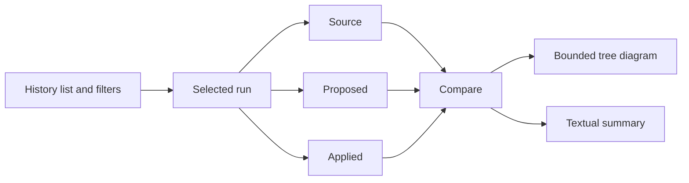

# Structure History Page

Structure History is an advanced, non-AI page near Compare snapshots and Operation history. It lists bounded restructuring records and filters them by root, date, status, preview/applied state, and current-match state.

Selecting a run exposes:

- Source, proposed, and applied snapshot summaries.
- Counts and per-item outcome status.
- Structure hash and proposal source.
- Read-only tree diagrams and accessible text.
- Comparison classifications: Added, Removed, Moved, Renamed, Unchanged, Failed, and Skipped.

The tree initially expands only bounded depth, aggregates large folders, supports search, and limits the visible projection. No diagram action reads file contents or changes a file.

