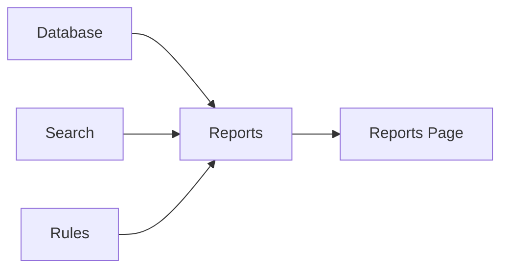

# Reports Overview

> This document provides an overview of the Reports subsystem, which is responsible for generating analytical reports, statistics, and exportable insights from information managed by OpenSorSe.

---

## Implementation Status

The Reports subsystem is future architecture only. The validated v0.2 release does not generate analytical reports, exports, trends, or AI outcome reports. The design below is not a shipped feature set or release commitment.

---

## Purpose

The Reports subsystem transforms application data into meaningful summaries, statistics, and analytical reports.

Its purpose is to help users understand their document library, monitor processing activity, evaluate automation, and gain actionable insights without modifying the underlying data.

The Reports subsystem analyzes existing information but does not generate new document knowledge or perform application workflows.

---

# Responsibilities

The Reports subsystem is responsible for:

* Generating analytical reports.
* Producing application statistics.
* Summarizing processing activity.
* Reporting duplicate information.
* Reporting AI processing outcomes.
* Supporting report exports.

---

# Scope

### In Scope

* Statistics
* Analytical reports
* Data summaries
* Trend analysis
* Report generation
* Report exports

### Out of Scope

The Reports subsystem is **not** responsible for:

* AI inference
* Search execution
* Database management
* Rule execution
* User interface rendering
* Business logic

These responsibilities belong to other architectural subsystems.

---

# Architectural Overview

The Reports subsystem retrieves information from application data sources and generates analytical outputs.

The Reports subsystem generates information for presentation while remaining independent of the graphical user interface.

---

# Report Components

The Reports subsystem consists of several specialized components.

| Component         | Responsibility                               |
| ----------------- | -------------------------------------------- |
| Statistics        | Generates numerical summaries and metrics.   |
| Cleanup Report    | Identifies cleanup opportunities.            |
| Duplicates Report | Summarizes duplicate detection results.      |
| AI Report         | Reports AI processing activity and insights. |
| Export            | Produces portable report formats.            |

Each component is documented separately within this section.

---

# Report Workflow

A typical reporting workflow consists of the following stages:

1. Receive a report request.
2. Retrieve relevant application data.
3. Perform analysis.
4. Generate report content.
5. Format the report.
6. Return the completed report for presentation or export.

Report generation should remain independent of how information is displayed.

---

# Data Sources

Reports may analyze information including:

* Document metadata.
* Processing history.
* AI enrichments.
* Duplicate detection results.
* Search statistics.
* Rule execution history.
* Storage information.

Additional report sources may be introduced as the application evolves.

---

# Design Principles

The Reports subsystem should remain:

* Read-only.
* Deterministic.
* Extensible.
* Independent of presentation.
* Focused on analysis.

Its responsibility is limited to transforming stored information into meaningful reports.

---

# Future Considerations

The architecture should support future enhancements, including:

* Scheduled reports.
* Comparative reports.
* Historical trend analysis.
* Plugin-defined reports.
* AI-generated insights.
* Interactive analytics.

These enhancements should preserve the Reports subsystem's primary responsibility of analyzing application information.

---

# Related Documents

* [Statistics](01_Statistics.md)
* [Cleanup Report](02_Cleanup_Report.md)
* [Duplicates Report](03_Duplicates_Report.md)
* [AI Report](04_AI_Report.md)
* [Export](05_Export.md)
* [Reports Page](../08_GUI/07_Reports_Page.md)
