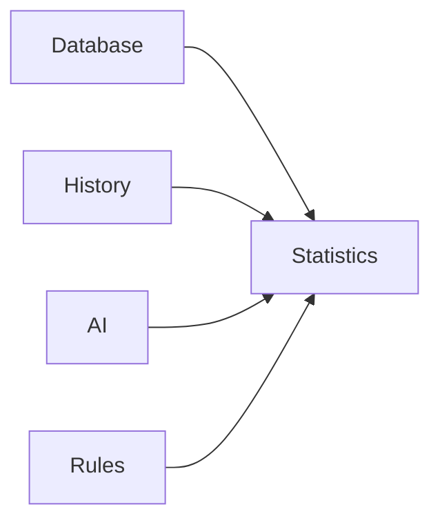

# Statistics

> This document defines the Statistics component, which is responsible for generating numerical summaries and measurable insights about documents, processing activities, and application usage within TidyMind.

---

## Purpose

The Statistics component produces quantitative information describing the current state and historical activity of the application.

Its purpose is to summarize measurable characteristics of the document library, processing pipeline, and application performance, enabling users to quickly understand the overall state of their data.

Statistics provide measurements rather than interpretations.

---

# Responsibilities

The Statistics component is responsible for:

* Calculating document statistics.
* Producing processing metrics.
* Summarizing storage usage.
* Measuring automation activity.
* Reporting application metrics.
* Supporting analytical reports.

---

# Scope

### In Scope

* Document counts
* Storage metrics
* Processing metrics
* AI metrics
* Rule metrics
* Historical statistics

### Out of Scope

The Statistics component is **not** responsible for:

* AI interpretation
* Report visualization
* Search execution
* Business logic
* Database management
* User interface rendering

These responsibilities belong to other architectural components.

---

# Architectural Overview

The Statistics component gathers measurable information from application subsystems and produces structured metrics.

The Statistics component calculates numerical summaries without modifying application data.

---

# Statistics Workflow

A typical statistics generation process consists of the following stages:

1. Receive a statistics request.
2. Retrieve relevant application data.
3. Calculate required metrics.
4. Aggregate the results.
5. Return structured statistical information.

Statistics should remain deterministic for identical datasets.

---

# Available Metrics

The architecture should support metrics including:

| Metric              | Description                                    |
| ------------------- | ---------------------------------------------- |
| Document Count      | Total managed documents.                       |
| Storage Usage       | Total storage consumed.                        |
| File Types          | Distribution of supported document types.      |
| AI Processing       | Documents classified, summarized, or embedded. |
| Duplicate Detection | Number of detected duplicate files.            |
| Rule Activity       | Executed automation rules.                     |
| Scan Activity       | Scan frequency and processed files.            |

Additional metrics may be introduced as the application evolves.

---

# Measurement Principles

Statistics should be:

* Accurate.
* Repeatable.
* Consistent.
* Easy to understand.
* Efficient to calculate.

Metrics should represent measurable facts rather than subjective assessments.

---

# Design Principles

The Statistics component should remain:

* Read-only.
* Deterministic.
* Independent of visualization.
* Extensible.
* Focused on measurement.

Its responsibility is limited to generating numerical summaries.

---

# Error Handling

Statistics generation failures should degrade gracefully.

Examples include:

* Missing data.
* Incomplete history.
* Calculation failures.
* Corrupted statistical records.

Whenever practical, partial statistics should remain available even if some metrics cannot be calculated.

---

# Future Considerations

The architecture should support future enhancements, including:

* Historical trend analysis.
* Comparative statistics.
* User-defined metrics.
* Plugin-defined statistics.
* Real-time dashboards.
* Predictive metrics.

These enhancements should preserve the Statistics component's primary responsibility of producing measurable information.

---

# Related Documents

* [Reports Overview](00_Overview.md)
* [Cleanup Report](02_Cleanup_Report.md)
* [Duplicates Report](03_Duplicates_Report.md)
* [AI Report](04_AI_Report.md)
* [Reports Page](../08_GUI/07_Reports_Page.md)
