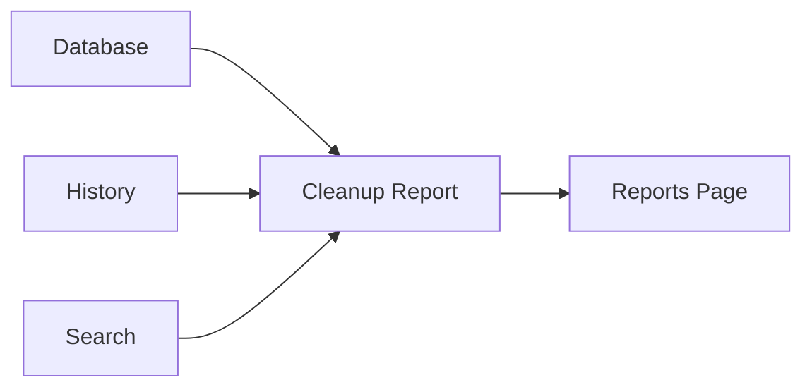

# Cleanup Report

> This document defines the Cleanup Report component, which is responsible for identifying opportunities to improve the organization, efficiency, and cleanliness of a user's document library.

---

## Purpose

The Cleanup Report analyzes the document library to identify files and folders that may benefit from user review or reorganization.

Its purpose is to highlight opportunities for cleanup, improved organization, and storage optimization while leaving all decisions under the user's control.

The Cleanup Report provides recommendations only and does not perform cleanup operations.

---

# Responsibilities

The Cleanup Report is responsible for:

* Identifying cleanup opportunities.
* Highlighting organizational issues.
* Reporting storage inefficiencies.
* Recommending areas for review.
* Supporting library maintenance.

---

# Scope

### In Scope

* Storage analysis
* Organization analysis
* Duplicate summaries
* Uncategorized documents
* Large file identification
* Cleanup recommendations

### Out of Scope

The Cleanup Report is **not** responsible for:

* Deleting files
* Moving documents
* Rule execution
* AI inference
* Business logic
* User interface rendering

These responsibilities belong to other architectural components.

---

# Architectural Overview

The Cleanup Report analyzes information from multiple subsystems to generate actionable recommendations.

The Cleanup Report analyzes existing information without modifying the document library.

---

# Report Workflow

A typical cleanup report consists of the following stages:

1. Retrieve relevant document information.
2. Analyze organizational patterns.
3. Detect cleanup opportunities.
4. Generate recommendations.
5. Produce the final report.

Recommendations should remain informative rather than prescriptive.

---

# Report Categories

The architecture should support recommendations including:

| Category                     | Description                                                                      |
| ---------------------------- | -------------------------------------------------------------------------------- |
| Large Files                  | Documents consuming significant storage.                                         |
| Duplicate Candidates         | Potential duplicate files.                                                       |
| Uncategorized Documents      | Files lacking meaningful organization.                                           |
| Empty Folders                | Folders containing no managed documents.                                         |
| Unused Files                 | Documents with little or no recent activity where such information is available. |
| Organizational Opportunities | Suggestions for improving folder structure.                                      |

Additional report categories may be introduced as the application evolves.

---

# Recommendation Principles

Recommendations should be:

* Informative.
* Explainable.
* Non-destructive.
* Prioritized.
* Actionable.

Users should always understand why a recommendation was generated.

---

# Design Principles

The Cleanup Report should remain:

* Read-only.
* Independent of automation.
* Extensible.
* Deterministic where practical.
* Focused on recommendations.

Its responsibility is limited to identifying opportunities for improvement.

---

# Error Handling

Cleanup analysis should handle incomplete information gracefully.

Examples include:

* Missing metadata.
* Partial scan results.
* Incomplete processing history.
* Unsupported document types.

Whenever practical, partial recommendations should still be generated.

---

# Future Considerations

The architecture should support future enhancements, including:

* AI-assisted cleanup recommendations.
* Folder health scores.
* Cleanup prioritization.
* Scheduled cleanup reports.
* Plugin-defined cleanup analyzers.
* Storage optimization suggestions.

These enhancements should preserve the Cleanup Report's primary responsibility of identifying cleanup opportunities.

---

# Related Documents

* [Reports Overview](00_Overview.md)
* [Statistics](01_Statistics.md)
* [Duplicates Report](03_Duplicates_Report.md)
* [AI Report](04_AI_Report.md)
* [Reports Page](../08_GUI/07_Reports_Page.md)
* [Rules Overview](../07_Rules/00_Overview.md)
