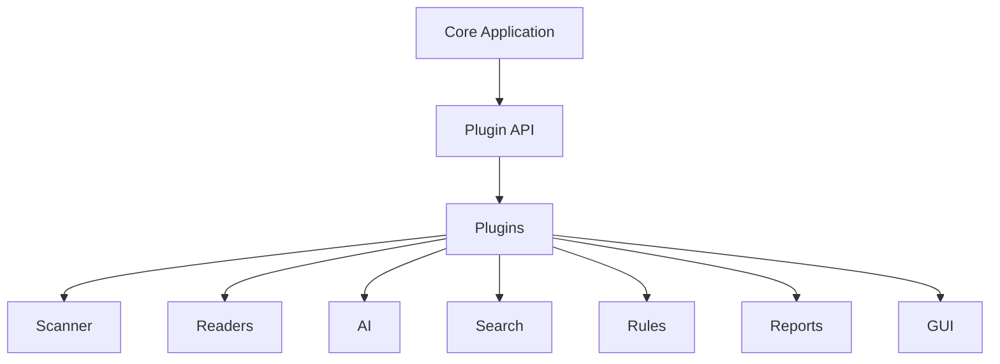

# Plugins Overview

> This document provides an overview of the Plugins subsystem, which enables third-party developers to extend TidyMind with additional functionality while preserving the integrity of the core application.

---

## Purpose

The Plugins subsystem provides a structured mechanism for extending TidyMind without modifying its core source code.

Its purpose is to enable developers to introduce new capabilities, integrations, and custom behaviors through well-defined extension points while maintaining compatibility with the application's architecture.

The Plugins subsystem extends the application but does not replace or modify the responsibilities of the core subsystems.

---

# Responsibilities

The Plugins subsystem is responsible for:

* Discovering plugins.
* Loading plugins.
* Managing plugin lifecycles.
* Providing extension points.
* Enforcing plugin isolation.
* Supporting secure plugin execution.

---

# Scope

### In Scope

* Plugin discovery
* Plugin loading
* Plugin lifecycle management
* Extension points
* Plugin security
* Plugin compatibility

### Out of Scope

The Plugins subsystem is **not** responsible for:

* Business logic
* AI inference
* Search execution
* Database management
* User interface rendering
* Core application behavior

These responsibilities belong to the core application.

---

# Architectural Overview

The Plugins subsystem provides extension points through which external modules can interact with the application.

Plugins interact with the application exclusively through supported extension interfaces.

---

# Plugin Components

The Plugins subsystem consists of several specialized components.

| Component  | Responsibility                                        |
| ---------- | ----------------------------------------------------- |
| Plugin API | Defines the public extension interfaces.              |
| Discovery  | Locates available plugins.                            |
| Loading    | Loads and initializes plugins.                        |
| Lifecycle  | Manages plugin startup, shutdown, and updates.        |
| Security   | Protects the application from unsafe plugin behavior. |

Each component is documented separately within this section.

---

# Plugin Workflow

A typical plugin lifecycle consists of the following stages:

1. Discover available plugins.
2. Validate compatibility.
3. Load plugin metadata.
4. Initialize the plugin.
5. Register extension points.
6. Execute plugin functionality when requested.
7. Unload the plugin during shutdown or deactivation.

Plugins should integrate seamlessly without disrupting the core application.

---

# Extension Areas

Plugins may extend areas including:

* Document readers.
* AI providers.
* Search providers.
* Automation actions.
* Report generators.
* Export formats.
* GUI components.
* Themes.
* External integrations.

Additional extension points may be introduced as the application evolves.

---

# Design Principles

The Plugins subsystem should remain:

* Modular.
* Secure.
* Stable.
* Backward compatible where practical.
* Independent of plugin implementations.

The core application should remain fully functional even when no plugins are installed.

---

# Future Considerations

The architecture should support future enhancements, including:

* Plugin marketplace.
* Automatic plugin updates.
* Plugin dependency management.
* Remote plugin repositories.
* Plugin analytics.
* Community-developed extension libraries.

These enhancements should preserve the Plugins subsystem's primary responsibility of enabling safe and reliable application extensibility.

---

# Related Documents

* [Plugin API](01_Plugin_API.md)
* [Discovery](02_Discovery.md)
* [Loading](03_Loading.md)
* [Lifecycle](04_Lifecycle.md)
* [Security](05_Security.md)
* [GUI Overview](../08_GUI/00_Overview.md)
