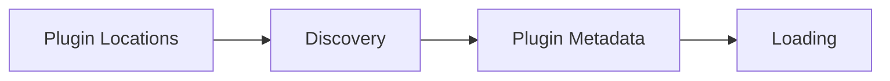

# Discovery

> This document defines the Discovery component, which is responsible for locating and identifying plugins that are available to the TidyMind application.

---

## Purpose

The Discovery component locates plugins that may be available for use by TidyMind.

Its primary purpose is to identify plugin packages, collect their metadata, and provide a list of discoverable plugins to the loading subsystem without executing plugin code.

Discovery identifies plugins but does not load or initialize them.

---

# Responsibilities

The Discovery component is responsible for:

* Locating plugin packages.
* Reading plugin metadata.
* Identifying supported plugins.
* Detecting plugin versions.
* Providing discovered plugin information.
* Supporting multiple plugin locations.

---

# Scope

### In Scope

* Plugin discovery
* Metadata discovery
* Version detection
* Plugin identification
* Plugin manifests
* Discovery configuration

### Out of Scope

The Discovery component is **not** responsible for:

* Plugin loading
* Plugin execution
* Plugin lifecycle management
* Plugin security validation
* Business logic
* User interface rendering

These responsibilities belong to other architectural components.

---

# Architectural Overview

The Discovery component scans configured plugin locations and reports available plugins to the loading subsystem.

The Discovery component identifies available plugins without executing their code.

---

# Discovery Workflow

A typical discovery process consists of the following stages:

1. Read configured plugin locations.
2. Search for plugin packages.
3. Locate plugin manifests.
4. Read plugin metadata.
5. Validate basic metadata structure.
6. Return the list of discovered plugins.

Discovery should remain lightweight and independent of plugin execution.

---

# Discovered Information

The architecture should support discovering metadata including:

| Information           | Description                              |
| --------------------- | ---------------------------------------- |
| Plugin Name           | Human-readable plugin name.              |
| Plugin Identifier     | Unique plugin identifier.                |
| Version               | Plugin version information.              |
| Author                | Plugin developer or organization.        |
| Supported API Version | Compatible Plugin API version.           |
| Description           | Short summary of the plugin.             |
| Declared Capabilities | Extension points provided by the plugin. |

Additional metadata fields may be introduced as the plugin ecosystem evolves.

---

# Discovery Principles

Plugin discovery should be:

* Lightweight.
* Predictable.
* Deterministic.
* Independent of execution.
* Safe.

Discovery should never require executing plugin code.

---

# Design Principles

The Discovery component should remain:

* Fast.
* Modular.
* Extensible.
* Independent of plugin loading.
* Focused on identification.

Its responsibility is limited to locating and describing available plugins.

---

# Error Handling

Discovery failures should affect only the relevant plugin.

Examples include:

* Missing plugin manifests.
* Invalid metadata.
* Unsupported manifest versions.
* Corrupted plugin packages.
* Duplicate plugin identifiers.

Whenever practical, invalid plugins should be skipped while valid plugins remain available.

---

# Future Considerations

The architecture should support future enhancements, including:

* Remote plugin repositories.
* Automatic discovery refresh.
* Plugin categories.
* Digital signature metadata.
* Plugin dependency metadata.
* Plugin marketplace integration.

These enhancements should preserve the Discovery component's primary responsibility of identifying available plugins.

---

# Related Documents

* [Plugins Overview](00_Overview.md)
* [Plugin API](01_Plugin_API.md)
* [Loading](03_Loading.md)
* [Lifecycle](04_Lifecycle.md)
* [Security](05_Security.md)
