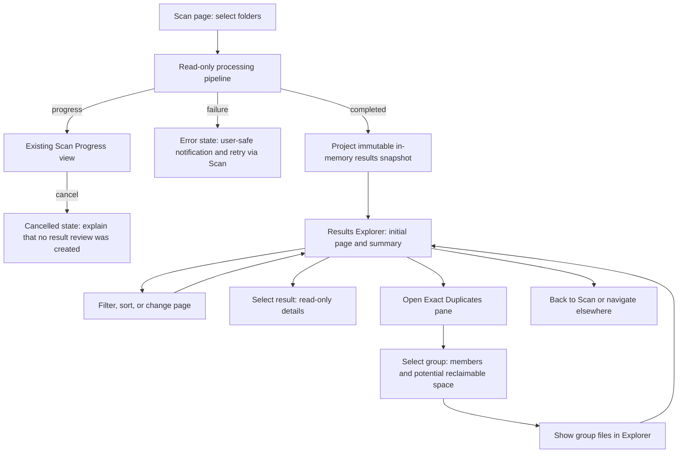

# OpenSorSe v0.2 Release Proposal

| Field | Value |
| --- | --- |
| Product | OpenSorSe |
| Target release | v0.2 |
| Status | Implemented; manual GUI validation remains required |
| Scope type | Read-only implementation release |
| Primary theme | Read-only results exploration and exact-duplicate review |
| Related specifications | 029, 030, 031 |
| Baseline branch at planning time | `coding/v0.1` (documentation branch: `docs/v0.2-specification`) |

## 1. Executive proposal

OpenSorSe v0.2 should make the output of an existing completed scan useful to review without changing a single user file. It adds a bounded, responsive results explorer with filtering, sorting, paging, file details, and a focused exact-duplicate review surface.

The release is deliberately **not** an execution release. v0.1 already has planning, executor, and undo components in source, but its Desktop workflow intentionally does not expose file operations. v0.2 preserves that boundary. It neither invokes `IActionExecutor` nor `IUndoEngine`, and it adds no confirmation flow for mutation because it adds no mutation.

The implementation package is:

| Spec | Component | Purpose | Complexity |
| --- | --- | --- | --- |
| 029 | Results snapshot projection | Convert completed in-memory processing output to an immutable, UI-safe review snapshot. | Medium |
| 030 | Results explorer | Let users find, filter, sort, page, and inspect scan results without rescanning. | Medium |
| 031 | Exact-duplicate review | Let users understand existing exact-hash duplicate groups and their potential storage impact. | Medium |

## 2. Current baseline and evidence

### Implemented v0.1 boundary

Repository source shows these relevant current capabilities:

- `OpenSorSe.Application` orchestrates scanner, metadata reader, SHA-256 hashing, metadata classification, exact duplicate detection, rule evaluation, action planning, and lexical conflict resolution through `IProcessingOrchestrator`.
- `IProcessingSessionManager` tracks those sessions only in memory. A completed `ProcessingSessionResult` contains the resulting `ProcessingResult`.
- `DuplicateDetector` already produces deterministic exact-content `DuplicateGroup` values from supported SHA-256 hashes. It reads no files during detection and never changes files.
- The Avalonia shell (`MainViewModel`) drives the read-only pipeline, shows progress and cancellation, and then loads `ResultsViewModel`.
- The current `ResultsViewModel` displays unfiltered lists of files, directories, planned operations, and warnings. It does not provide search, filtering, sorting, pagination, file details, or duplicate-group review.
- `IActionExecutor` and `IUndoEngine` are registered, but the v0.1 Desktop view deliberately has no execution controls. Their existence is not authorization to expose them.

### Implemented but not yet locally GUI-verified

The recent v0.1 engineering-review/progress report describes the scan pipeline, Desktop views, application controller, sessions, event bus, and error handler as implemented but not locally verified. It records blocked local restore/build/test verification in the prior environment and specifically calls for host verification of Avalonia XAML, test discovery, filesystem behavior, and the complete GUI workflow.

Therefore no v0.2 behaviour is claimed to exist. Specifications 029–031 are conditional proposals and must be revised if the validation findings in section 12 invalidate their assumptions.

### Documentation observations that constrain v0.2

- Architecture documents describe a long-term Readers, AI, Database, Search, Reports, and Plugins vision. The corresponding source projects do not exist in the v0.1 solution, so those documents are architecture intent, not an implemented v0.1 capability.
- `docs/Architecture/03_Readers/00_Overview.md` currently contains Scanner error-handling content rather than a Readers overview. This is a documentation contradiction, not a reason to redesign the application. It should be corrected in a later documentation-maintenance task.
- The README identifies v0.1 as read-only and lists no AI classification, semantic search, embedded-document readers, rule persistence, or execution UI. The v0.2 scope honors that published boundary.

## 3. Selected theme and rationale

### Theme: Read-only results exploration and exact-duplicate review

After a scan, a user should be able to answer three simple questions without exporting data or scanning again:

1. What did OpenSorSe find?
2. Which files match the property I care about?
3. Which files are exact duplicates, and what storage opportunity do they represent?

This is the best v0.2 theme because it converts the already-implemented analysis pipeline into a more understandable, trustworthy workflow. It has a narrow dependency surface, is easy to test deterministically with existing immutable models, preserves local-first privacy, and keeps every filesystem operation read-only.

### Alternatives evaluated and deferred

| Candidate | Reason not selected for v0.2 |
| --- | --- |
| Session/result persistence | Requires an approved durable schema, migration policy, retention/privacy decisions, recovery semantics, and corruption handling. The v0.1 session manager is intentionally process-lifetime only. |
| Rule authoring and preview | Rule persistence and an end-to-end simulation contract are deferred by v0.1. Broadening both the rule editor and results workflow would make the release less focused. |
| Controlled first execution | Requires current-state revalidation, live conflict detection, explicit authorization, audit durability, recovery, rollback limits, and manual validation of the v0.1 UX. Too much safety-critical work for this increment. |
| Semantic/keyword search | The designed Search subsystem and its storage/indexing dependencies are not implemented. An in-memory result filter solves an immediate user problem without pretending to be library search. |
| AI, OCR, or content readers | These depend on unimplemented subsystems and introduce substantial privacy, package, model, and performance decisions. |
| Cross-platform certification | Avalonia supports a future cross-platform direction, but v0.1 has not yet completed even local GUI verification. |

## 4. Scope boundaries

### In scope for v0.2

- Immutable projection of a successfully completed, in-memory v0.1 processing result into result-review data.
- In-memory text filtering by file name/path, extension, and deterministic classification display value.
- In-memory filters for duplicate state and planned-operation presence.
- Stable sorting and bounded paging of result rows.
- Read-only file-detail presentation for a selected result.
- Review of the existing exact SHA-256 duplicate groups, including group membership and conservative potential-reclaimable-space calculation.
- Clear empty, loading, cancelled, and error states within the existing Results destination.
- Unit, integration, ViewModel, filesystem-fixture, and manual GUI coverage appropriate to this UI and projection work.

### Explicitly out of scope

- AI integration, local or cloud AI providers, prompts, embeddings, and AI explanations.
- Semantic search, library-wide keyword indexing, content indexing, OCR, image recognition, and person recognition.
- Reader implementations for PDF, DOCX, Excel, images, audio, video, archives, or embedded metadata.
- Rule persistence, rule simulation, broad rule editing changes, or automatic unattended organization.
- Executing, deleting, moving, copying, renaming, overwriting, or changing permissions on user files.
- Executing existing planned operations or exposing executor/undo controls.
- Persistent scan sessions, persistent result history, SQLite introduction, result export, cloud synchronization, collaboration, mobile applications, or a plugin marketplace.
- Network-share support promises, filesystem watching, scheduled scans, incremental rescans, multi-window workspaces, and full cross-platform certification.

### Future candidates (v0.3 or later)

- Result-session persistence after a dedicated storage/retention/migration design.
- A distinct rules-preview workflow with explicit simulation semantics.
- Report export, following a privacy and sensitive-metadata review.
- File-content readers, keyword indexing, and search as separately staged work.
- A controlled execution release only after live preflight, authorization, audit/undo durability, recovery, and manual safety testing are specified.
- Near-duplicate analysis, image similarity, and AI-assisted recommendations only after their required subsystems exist.

## 5. Architecture impact assessment

v0.2 is additive. It does not change the existing scanner, rule, executor, lifecycle, configuration, event-bus, or application-controller responsibilities.

| Proposed component | Existing dependencies | New abstraction | Persistence | UI dependency | Platform/security concern |
| --- | --- | --- | --- | --- | --- |
| Results snapshot projection | `ProcessingSessionResult`, `ProcessingResult`, `FileEntry`, `DuplicateDetectionResult`, `ConflictResolutionResult` | `IResultsSnapshotProjector` and immutable projection records in `OpenSorSe.Application` | None; process memory only | Called by existing Desktop shell after a completed session | Must not read paths again, access file contents, expose hashes, or log file lists. |
| Results explorer | Existing Results destination, `ResultsViewModel`, Avalonia, CommunityToolkit MVVM | Query, sort, page, and selected-detail presentation models in `OpenSorSe.Desktop` | None | Extends existing `ResultsView` in place | UI work must stay responsive; uses ordinal, culture-independent matching and no shell/file launch. |
| Exact-duplicate review | `DuplicateGroup` data already reached by the pipeline; snapshot projection | Read-only duplicate group/detail projection in existing Results destination | None | Results subview/tab/pane; no new top-level navigation | Never treats groups as deletion candidates or chooses a file to retain; no raw hash display. |

### Compatibility and migration assessment

No configuration format, application-data location, persisted schema, database, storage format, public package, solution project, or package dependency changes are required by the proposed release.

`ApplicationSettings` remains unchanged. Results exist only while the current process remains open, as in v0.1. Closing the application discards v0.2 result-review state. This is intentional and requires no data migration, rollback, backup, or corruption recovery path.

The only public-interface additions are additive contracts and immutable records in `OpenSorSe.Application` plus Desktop presentation types. Existing `IProcessingOrchestrator`, `IProcessingSessionManager`, `IApplicationController`, `IActionExecutor`, and `IUndoEngine` contracts remain unchanged. The DI composition root receives one additional singleton projector registration if specification 029 is implemented.

## 6. Recommended implementation order

Implementation order is mandatory: duplicate review consumes the projected duplicate-group data; the explorer establishes the reusable bounded list and selection behaviour first.

## 7. Focused v0.2 feature list

| Order | Feature | User problem solved and behaviour | Components | Safety constraints | Acceptance criteria | Complexity | Depends on pending v0.1 validation? |
| --- | --- | --- | --- | --- | --- | --- | --- |
| 1 | Results snapshot | Raw pipeline output is not a stable UI contract. On completed processing, create one immutable in-memory review snapshot containing result rows, groups, operations, and user-safe issues. | Application, Scanner/Rules result models, DI | Read process memory only; no file I/O, no persistence, no raw hash display. | Same input gives equivalent projection; source records remain unchanged; cancelled/failed processing is not projected as completed results. | Medium | Yes—completion/result handoff and cancellation outcomes must be confirmed. |
| 2 | Results explorer | Users cannot locate a file in a long static list. They can filter, sort, page, select, and inspect results without changing the scan. | Desktop Results ViewModel/View, Avalonia | In-memory, read-only; bounded page; no launch/open/reveal/execution command. | Query/filter/sort are deterministic; empty state is clear; selected details match source; UI remains responsive with large fixtures. | Medium | Yes—results comprehension and responsiveness must be confirmed. |
| 3 | Exact-duplicate review | A count of duplicate groups does not explain where duplicate files are. Users can inspect group members and conservative reclaimable bytes, then return to the filtered file result. | Snapshot projector, Desktop results subview | Exact hashes only; presentation never recommends deletion, selects a keeper, or invokes executor. | Membership reflects detector output; unknown-hash entries are excluded and explained; no hash string is displayed; no file changes occur. | Medium | Yes—duplicate results and safety messaging must be understood in v0.1 testing. |

## 8. Proposed user flow

The existing shell and `NavigationDestination.Results` remain the entry point. No new application-wide navigation model is introduced.

### States and messaging

| State | Required presentation |
| --- | --- |
| Loading projection/query | Busy indication without a fabricated percent; controls that would race the current projection/query are disabled. |
| No completed results | Explain that a completed scan is required and provide a non-mutating route to Scan. |
| Empty filter result | State the active filters and provide a visible Clear filters action. |
| No duplicate groups | State that no exact SHA-256 duplicate groups were found; do not imply a broader similarity check. |
| Cancelled scan | Preserve the existing v0.1 cancellation message; do not create a review snapshot from incomplete pipeline data. |
| Projection/query error | Keep the prior valid view if one exists, show a user-safe error, log diagnostic context without full file lists, and allow the user to return to Scan. |

There are no destructive confirmations in this release. A persistent safety message in the Results view must say that review is read-only and OpenSorSe will not change, move, rename, or delete files from this screen.

## 9. Dedicated safety review

| v0.2 feature | Reads user files | Writes application data | Modifies/deletes/moves/renames user files | Changes permissions | Follows links/reparse points | Sensitive metadata handling |
| --- | --- | --- | --- | --- | --- |
| 029 Results snapshot | No additional reads; consumes existing in-memory output | No | No | No | No traversal or resolution | Keeps only fields needed for local display; must not log or display raw hashes. |
| 030 Results explorer | No | No | No | No | No | Displays already-scanned local paths and filesystem metadata only in-memory. |
| 031 Exact-duplicate review | No | No | No | No | No | Uses prior exact-hash grouping but must not render hash values; member paths remain local UI data only. |

No mutation is proposed, so preview, authorization, dry run, transaction, rollback, undo, failure recovery, partial-completion, and audit-log requirements for mutation are deliberately **not applicable**. The implementation must not create a hidden mutation path, shell-launch a file manager, or bind existing approval/execution events to an executor.

If a later release proposes mutation, it must separately specify: a fresh live filesystem preflight; explicit per-run authorization; preview/dry-run comparison; conflict policy; durable audit record; rollback boundaries; undo eligibility; interruption recovery; and a clear partial-completion experience.

## 10. v0.2 testing matrix

| Component | Unit tests | Integration tests | ViewModel tests | Filesystem/platform tests | Manual GUI tests | Safety tests | Regression risks |
| --- | --- | --- | --- | --- | --- | --- | --- |
| 029 Results snapshot projector | Null/invalid terminal result, deterministic projection, source immutability, issue aggregation, duplicate-group preservation, unknown metadata | Completed v0.1 `ProcessingSessionResult` fixture through projection | N/A | Fixture paths containing case, Unicode, long paths, inaccessible-source issue records, reparse-point scan outputs | Confirm completion reaches Results exactly once | Assert no `File`, `Directory`, executor, or undo access; assert no raw hashes/logged file list | Breaks existing completion handoff or loses warning/operation data |
| 030 Results explorer | Query matching, filter combinations, stable sort tie-breaks, bounds, page math, empty results | Projected 10k+ item fixture to page/detail output | Loading, clear filters, cancellation of stale query, selected detail, error retention, navigation | Windows case behaviour plus platform-neutral ordinal comparison; long/Unicode paths; files with missing metadata | Filter/sort/page, no-results, keyboard selection, resize, responsiveness during a realistic scan result | Assert all commands are review/navigation-only and never reference executor/shell launch | UI freezes, stale selection, unbounded rendering, v0.1 result regression |
| 031 Duplicate review | Exact group order, membership, group filter route, reclaimable-byte calculation, absent size, unknown hashes | Detector fixture -> projector -> duplicate review | No groups, group selection, member count, return-to-explorer route, warning text | Duplicate files, same name/different paths, duplicate output originating near reparse-point/inaccessible fixtures | Read group members, confirm wording does not recommend deletion or show a hash | Assert no keeper selection, delete/move/rename command, or executor invocation | Misleading group count or storage estimate; accidental execution affordance |
| Whole release | Validation of all public input models | Existing pipeline → snapshot → Results view on completed, cancelled, and failed runs | Existing v0.1 ViewModel suite plus new specs | Large dataset; permissions; symbolic links/reparse points; duplicate data; application restart (state intentionally absent) | Launch, folder selection, progress, cancellation, result readability, close during/after scan | Before/after directory manifest and write-probe demonstrate no changed user files | v0.1 launch, cancellation, responsiveness, and result handoff |

The large-data tests must include at least 10,000 projected rows and assert page-size bounding rather than requiring the view to instantiate every row. Tests must also cover invalid inputs, empty states, cancellation, errors, permissions, reparse points/symbolic links from scanner fixtures, duplicate data, application restart, and UI responsiveness. Persistence-corruption testing is explicitly not applicable because v0.2 persists no result data.

## 11. Phased delivery plan

Each phase is intentionally small enough for one focused implementation task after v0.1 validation gates allow it.

| Phase | Objective | Specifications | Likely projects/files | Required tests | Completion gate | Risks and dependencies |
| --- | --- | --- | --- | --- | --- | --- |
| 0 | Close the v0.1 validation gate and record findings. | None; may revise 029–031 | No v0.2 production changes | Manual GUI checklist in section 12 | Owner has recorded findings and approved scope assumptions. | v0.1 may reveal launch, picker, progress, cancellation, result, or shutdown defects. |
| 1 | Establish an immutable, UI-safe results snapshot. | 029 | `OpenSorSe.Application`, `OpenSorSe.Application.Tests`, Desktop composition root only for registration/call site | Projector unit and pipeline-integration tests | Projection is deterministic, non-persistent, and source-immutable. | Requires completed-result handoff to behave as specified in v0.1. |
| 2 | Implement bounded explorer state and view. | 030 | `OpenSorSe.Desktop`, `OpenSorSe.Desktop.Tests`, existing Results XAML/ViewModel | Query, sort, paging, selection, stale-work cancellation, large fixture tests | Existing results still show all summary/warnings and new explorer works with no results. | Avalonia binding/virtualization behaviour and UI responsiveness. |
| 3 | Add exact-duplicate review inside Results. | 031 | `OpenSorSe.Application` projection additions if needed, `OpenSorSe.Desktop`, associated tests | Group/member/reclaimable-size tests; executor non-use test | Duplicate view agrees with detector output and cannot change files. | Depends on Phases 1–2; wording must remain safety-clear. |
| 4 | Release-candidate verification. | 029–031 | Tests and manual test notes; no feature expansion | Full solution tests where environment permits; manual GUI matrix; before/after filesystem manifest | Owner signs off v0.1 and v0.2 read-only workflow, with known limitations documented. | Local platform, permissions, large result sets, and cancellation timing. |

## 12. Pending v0.1 validation findings

This checklist is a release gate, not a request to change v0.1 during planning.

### v0.1 UI correction-pass record

Manual validation identified an unused `Application` menu item, an unreadable Results layout with raw model rows, a Dashboard that retained zero values after a completed scan, an unlabeled log-retention field, technical logging terminology, an unexplained empty history page, and unclear empty or disabled states. The focused v0.1 correction pass resolves those implementation findings without implementing any v0.2 feature:

- [x] Removed the unused menu placeholder while retaining the operating-system OpenSorSe title bar.
- [x] Rebuilt the v0.1 Results layout around a separate summary, scrollable friendly file rows, long-path tooltips, warnings, and a read-only footer.
- [x] Connected the latest completed in-memory scan summary to the Dashboard for the remainder of the application session.
- [x] Added permanent labels, descriptions, and minimum-value guidance for diagnostic-log retention.
- [x] Simplified the aggregate logging page into user-facing Diagnostics and removed inert filtering/clear-display controls.
- [x] Clarified that v0.1 Operation History is empty because scans are review-only and are not persisted as file-operation history.
- [x] Added explanatory empty states for Results, Diagnostics, and Rules, and hid controls that have no useful v0.1 action.

These changes require final local GUI revalidation, especially resizing and long-path behaviour, but they do not alter the v0.2 proposal or implement specifications 029-031.

- [ ] Does the application launch reliably from a clean local user profile?
- [ ] Is folder selection intuitive, including the native picker when available and manual absolute path fallback when it is not?
- [ ] Does the progress view update correctly through scanning and later pipeline stages?
- [ ] Does cancellation behave correctly while scanning and during later processing stages?
- [ ] Are the existing results understandable enough to identify the data v0.2 should emphasize?
- [ ] Is performance acceptable on a realistic folder, including hashing and duplicate detection?
- [ ] Does the UI remain responsive during scanning, cancellation, result navigation, and window resize?
- [ ] Are errors understandable and do they suggest a safe next action?
- [ ] Does the application close cleanly during and after scans?
- [ ] Are any files unexpectedly changed? Verify with a before/after directory manifest on a non-critical test folder.
- [ ] Which workflow steps feel incomplete, misleading, or confusing to the project owner?
- [ ] Are exact duplicate counts/groups plausible on a folder with controlled duplicate fixtures?
- [ ] Do reparse-point, symbolic-link, inaccessible-folder, and missing-file behaviours match the documented read-only safety boundary?

| Finding area | Specifications that may require revision |
| --- | --- |
| Completion or cancellation does not produce stable result data | 029, 030, 031 |
| Existing Results terminology or layout is confusing | 030, 031 |
| Large scans make the application unresponsive | 029, 030, 031 (especially page size, background work, and loading messaging) |
| Duplicate output is surprising or incorrect | 029, 031; possibly a v0.1 defect must be resolved before v0.2 |
| Folder picker or scan flow needs correction | 030 only if entry/return navigation changes; otherwise keep v0.2 separate |
| Any unexpected filesystem change | Stop v0.2 implementation; investigate the v0.1 safety boundary before proceeding |

## 13. Risks and open decisions

| Item | Status | Required decision or mitigation |
| --- | --- | --- |
| v0.1 GUI is unverified | Open release gate | Perform and record the section 12 checklist before implementation. |
| Projection of very large results | Manageable design risk | Keep immutable source data, calculate/query off the UI thread, coalesce/cancel stale query work, and render only a bounded page. |
| Path and metadata sensitivity | Managed | Do not persist, export, transmit, or log detailed row data; expose paths only in the local Results UI. |
| Exact duplicate semantics | Accepted boundary | Label groups as exact SHA-256 duplicates only; do not call them similar files and do not display unsupported/unknown hashes as groups. |
| Existing `ResultsViewModel` contains approval events | Explicit non-goal | v0.2 must not bind them to buttons or execution services. Consider a later cleanup only if v0.1 validation identifies the unused surface as confusing. |
| Long-term architecture says SQLite/Search exist | Documentation/source divergence | Do not create either in v0.2. Treat them as later architecture intent and resolve with a dedicated proposal. |
| Cross-platform details | Deferred certification | Use platform-neutral comparison and Avalonia practices; verify the current local platform and retain cross-platform test cases as non-certification coverage. |

## 14. Recommended first implementation prompt (do not execute now)

> Implement only specification 029, `Results snapshot projection`, after confirming that the v0.1 manual-validation checklist has no blocker for completed-session result handoff. Work on the existing v0.2 documentation branch. Add the smallest additive `OpenSorSe.Application` immutable projection contract and implementation needed to transform a completed `ProcessingSessionResult` into a UI-safe in-memory results snapshot. Do not modify scanner, rules, executor, undo, configuration, or persistence behaviour. Do not read user files, write application data, expose raw hashes, or add UI execution controls. Register only the new projector in the existing Desktop composition root if needed. Add focused xUnit coverage for determinism, source immutability, cancelled/failed handling, duplicate-group preservation, issue aggregation, and the guarantee that no filesystem APIs are used. Run the relevant tests if the local environment permits, report any environment blocker, and stop after spec 029.

## 15. Definition of a successful v0.2 release

v0.2 is ready when a locally validated v0.1 scan can complete, the user can efficiently inspect its immutable results and exact duplicate groups, all safety tests demonstrate that review changes no user files, and the application remains responsive and closes cleanly. It is not successful if it adds execution, durable history, AI, broad search, or unvalidated platform promises.
