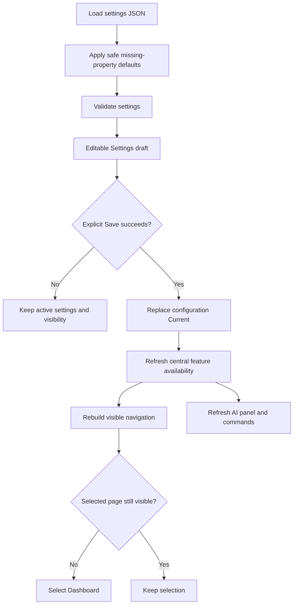
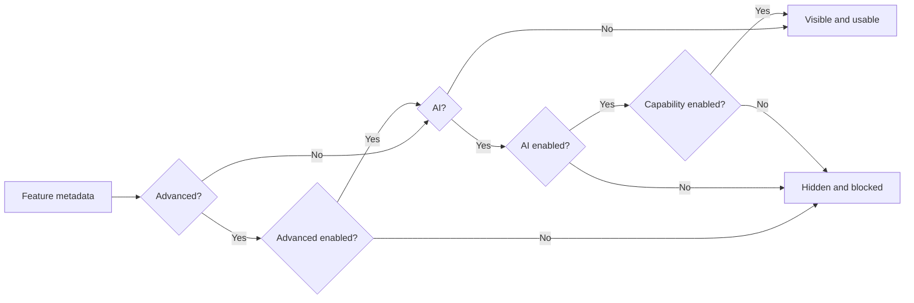
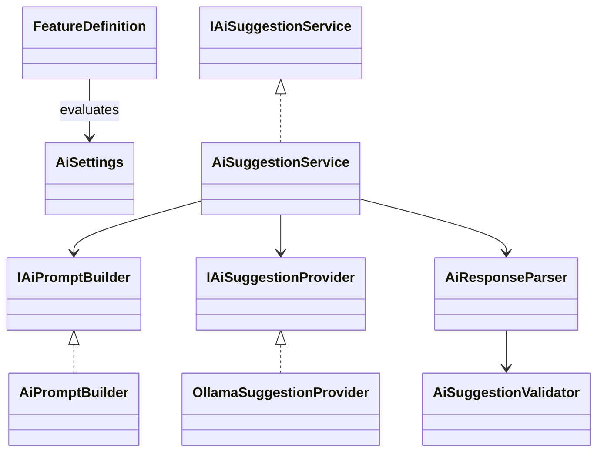
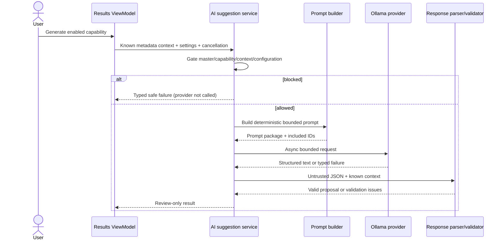
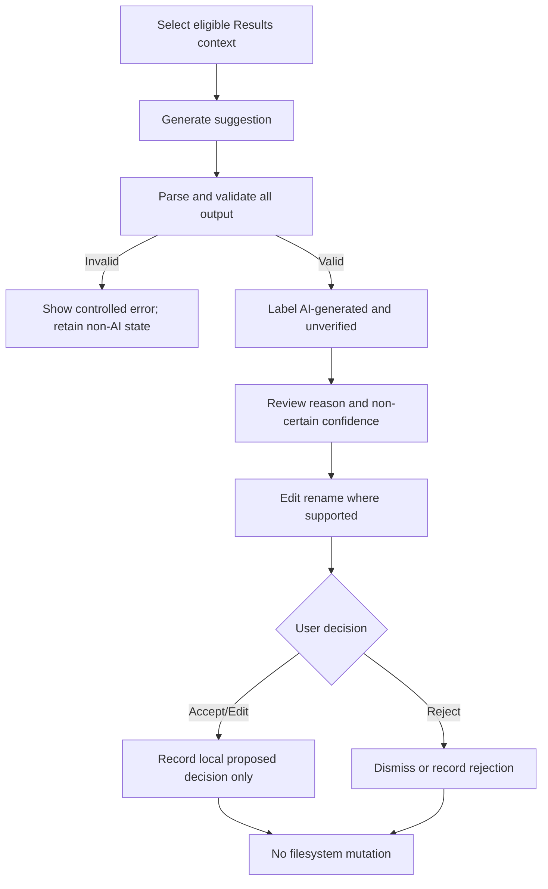

# Specification 046 - Optional AI and Advanced Feature Controls

| Field | Value |
| --- | --- |
| Component | Settings, feature visibility, AI application services, Ollama transport, Results review UI |
| Target release | v0.9.1 |
| Depends on | v0.9 application shell and catalog workflows; v0.3 optional AI provider boundary |

## 1. Release objective and current-state assessment

OpenSorSe is a local-first file organization and search application, not a chatbot or autonomous file agent. v0.9.1 refines the existing optional Ollama integration so AI is disabled by default, independently gated per capability, metadata-only, bounded, validated, and suggestion-only. An independent **Show advanced features** switch reduces interface complexity without resetting hidden values or hiding critical safety feedback.

The v0.9 baseline already provides asynchronous Ollama HTTP calls, bounded provider responses, local decision history, validation helpers, and a Results-hosted review panel. Gaps are that AI controls are always rendered, file prompts combine unrelated suggestion types, prompts and response DTOs are private methods inside the coordinator, commands do not consistently enforce settings, and navigation has no feature-classification metadata.

## 2. Scope, user stories, and non-goals

In scope:

- Persistent master switches for AI and advanced features, both off by default.
- Persistent independent switches for folder-structure and file-rename suggestions.
- Central feature requirements used by navigation, views, commands, and services.
- Save-driven shell visibility refresh with safe fallback to Dashboard when a selected destination becomes hidden.
- Dedicated deterministic prompts and strict JSON response contracts for the two capabilities.
- Metadata-only, review/edit/reject workflows that never call scanner or executor mutation APIs.
- Typed failures for disabled settings, invalid context, configuration, provider availability, timeout, cancellation, HTTP/model errors, empty/oversized responses, and invalid structured output.
- Compatibility with settings files that omit every new property.

User stories:

- As a user who does not want AI, I see only the master control and know no model request or provider detection can occur.
- As a user who enables AI, I can independently opt into rename and folder-structure proposals.
- As a user who prefers a simple interface, I can hide specialist diagnostics and provider details while retaining ordinary workflows.
- As an experienced user, I can expose advanced non-AI diagnostics independently from AI.
- As a reviewer, I can inspect, edit where supported, accept as a local decision, or reject an unverified proposal without changing a file.
- As a privacy-conscious user, I can verify that prompts contain bounded metadata and no file content or absolute path.

Out of scope:

- Automatic rename, move, create, delete, overwrite, batch execution, or direct integration with filesystem mutation services.
- General chat, autonomous planning, file-content upload, semantic indexing, embeddings, multi-provider discovery, remote account integration, or background model communication.
- v1.0 plugins, full localization, packaging overhaul, database migration, broad cross-platform release work, or new content readers.

## 3. Functional and non-functional requirements

The master AI switch is labelled **Enable AI features**. When off, only that master setting is visible; the Results AI panel and every AI action are hidden; commands return false; service entry points return a typed disabled result before provider or history access; connection/model discovery is blocked; and non-AI workflows remain usable.

The advanced switch is labelled **Show advanced features**. When off, specialist pages/sections/actions are hidden but their persisted values are preserved. AI and advanced mode are independent. A feature requiring both is visible and usable only when both are enabled.

The implementation shall preserve nullable correctness, asynchronous I/O, cancellation propagation, fixed timeouts, bounded allocations, ordinal deterministic ordering, platform-safe validation, DI constructor validation, safe logging, and MVVM separation. No prompt, raw response, file content, or absolute selected-file path is logged.

## 4. Settings model, persistence, and migration

`ApplicationSettings.Features.ShowAdvancedFeatures` defaults to `false`. `AiSettings.Enabled`, `AiSettings.FileRenameSuggestionsEnabled`, and `AiSettings.FolderStructureSuggestionsEnabled` default to `false`. Existing endpoint, selected model, timeout, and preference-adaptation values remain persisted even while hidden or inactive.

The existing `System.Text.Json` loader supplies property initializers/default values for missing members, so no destructive migration or schema rewrite is required. Missing groups continue to receive safe defaults. Save remains explicit. Draft-only toggles update dependent Settings sections immediately; application navigation and Results feature state update after a successful Save. Restart wording is limited to services that actually require restart.



## 5. Feature classification and visibility rules

Classification reflects user experience, not implementation complexity.

| Feature or page | Class | AI | Visibility condition | Reason |
| --- | --- | --- | --- | --- |
| Dashboard | Regular | No | Always | Primary overview and workflow entry. |
| Scan folders and progress | Regular | No | Always | Core read-only workflow. |
| Results explorer, filters, duplicate review | Regular | No | Always | Core review workflow and safety context. |
| Saved catalog | Regular | No | Always | Existing primary historical browsing workflow. |
| Catalog search and saved searches | Regular | No | Always | Ordinary metadata search workflow. |
| Compare snapshots | Advanced | No | Advanced | Specialized historical analysis with scope semantics. |
| Rules | Regular | No | Always | Ordinary deterministic organization planning. |
| Settings and critical status/errors | Regular | No | Always | Essential control and recovery surface. |
| Detailed diagnostics | Advanced | No | Advanced | Technical troubleshooting detail. |
| Operation-history internals | Advanced | No | Advanced | Specialist review of execution/undo internals. |
| About and version | Regular | No | Always | Essential product and support identity. |
| Rename suggestion panel/action | Regular | Yes | AI + rename capability | Narrow end-user assistance. |
| Folder-structure panel/action | Regular | Yes | AI + folder capability | Narrow end-user assistance. |
| Ollama endpoint/model/timeout/test/discovery | Advanced | Yes | AI + advanced | Low-level provider configuration. |
| Preference adaptation/reset and AI diagnostics | Advanced | Yes | AI + advanced | Technical/local-history controls. |
| AI master control | Regular | No | Always | Required privacy and communication control. |
| Capability switches | Regular | Yes | AI | Independent opt-in controls. |
| Advanced master control | Regular | No | Always | Interface-complexity control. |



## 6. AI capability and provider architecture

`AiCapability` identifies `FileRenameSuggestions` and `FolderStructureSuggestions`. Application-owned feature requirements and `AiSettings.IsCapabilityEnabled` provide one extensible policy. The application coordinator checks the master switch, capability, context, configuration, model, and cancellation before calling `IAiSuggestionProvider`.

Ollama remains the sole implementation in this patch. The provider owns `/api/tags` and `/api/generate`, bounded reads, HTTP translation, timeout distinction, cancellation, and model/HTTP failure messages. Application logic owns prompts, schemas, parsing, safety validation, and user-facing proposal models.



## 7. Prompt-building architecture and bounded inputs

Large prompts shall not appear in XAML, code-behind, commands, or ViewModels. `IAiPromptBuilder` produces an immutable prompt package containing task ID, prompt, included source IDs, and a bounded-input flag. Templates remain English-only but all prose is centralized for future localization.

Each prompt contains clearly delimited `taskIdentifier`, `objective`, `inputData`, `allowedReasoningScope`, `mandatoryRules`, `forbiddenBehaviors`, `requiredResponseSchema`, and `noSuggestionBehavior` sections. Context is deterministically JSON serialized. File content and absolute paths are never included.

Rename context includes exactly one opaque source ID, current filename/extension, safe category/tags where available, and an ordinally sorted bounded sibling-name list. Folder context is deterministically ordered and capped at 25 file records and 30 existing logical folder names. A bounded request is reported in the success message. Prompt bytes must remain below the provider transport limit.

## 8. Structured response contracts and validation

Unknown JSON properties are ignored for forward compatibility; expected required properties, types, enums, and all safety constraints remain strict. Markdown-fenced output is rejected rather than scraped. No partially parsed result is published.

Rename response:

```json
{
  "taskId": "file-rename-v1",
  "status": "suggestion",
  "sourceFileId": "opaque-known-id",
  "suggestedFileName": "safe-name.ext",
  "reason": "bounded explanation",
  "confidence": 0.72
}
```

Folder response:

```json
{
  "taskId": "folder-structure-v1",
  "status": "suggestion",
  "folders": [
    { "folderId": "f1", "name": "Invoices", "parentFolderId": null, "reason": "bounded explanation", "confidence": 0.68 }
  ],
  "assignments": [
    { "sourceFileId": "opaque-known-id", "folderId": "f1" }
  ],
  "reason": "bounded plan explanation"
}
```

Both contracts also permit `status: "no_suggestion"` with no actionable value and a bounded reason. Validation covers JSON shape, required fields, maximum lengths, task/status enums, confidence `0..1`, known source identities, duplicate IDs/assignments, result counts, folder-parent existence and cycles, portable invalid/reserved filename rules, extension preservation, identical-name no-change rejection, sibling conflicts, path separators, rooted values, traversal, empty values, and excessive output. Validation failures return issues suitable for safe diagnostics and concise UI text.

## 9. Request, review, and failure flows





Provider failures are isolated from scanning, search, catalog, duplicates, tags, snapshots, and saved searches. Normal UI never exposes stack traces. Messages distinguish disabled capability, invalid context, invalid endpoint/settings, missing model selection, unavailable endpoint/Ollama, timeout, cancellation, unavailable configured model, unsupported structured response, HTTP error, empty response, oversized response, and malformed provider/structured JSON.

## 10. UI, navigation, MVVM, and dependency injection

Settings order is: general/local catalog settings, AI master, AI capability switches visible only with AI, advanced master, advanced non-AI sections visible only with advanced, and advanced AI provider/history controls visible only with both. Hidden sections leave no empty bordered container. Focus order follows visual order.

The Results AI panel is visible only when at least one enabled AI capability is usable. Rename and folder subsections have separate visibility and command gates. Suggestions are labelled AI-generated/unverified, confidence is contextual rather than certainty, and acceptance records only a local review decision.

Navigation items carry maintainable feature requirements. Direct navigation to a hidden destination is rejected. After Save, the shell rebuilds navigation; if the selected page becomes hidden, Dashboard is selected. Keyboard/ListBox selection cannot bypass the same guard.

DI adds the prompt builder and parser/validator services while preserving a single reusable `HttpClient`, one provider implementation, and the application-owned coordinator. No service locator or UI-specific provider calls are introduced.

## 11. Privacy, safety, compatibility, and rollback

AI output is always untrusted. Neither valid nor invalid output is passed to scanner, rules executor, action executor, undo engine, `File`, or `Directory` mutation APIs. Provider requests contain metadata only, and logging contains capability/failure categories without prompt text, response text, content, or full paths.

Endpoint configurability is retained for compatibility, with explicit disclosure that non-loopback endpoints receive supplied metadata. AI disabled means no connection test, discovery, generation, or background provider communication. Advanced mode affects interface availability only and never resets stored values.

Rollback to v0.9 ignores new JSON properties. Existing v0.9 files load with new switches off. No new user-file state or irreversible migration is introduced.

## 12. Testing strategy

Core tests cover safe defaults, old-file migration, save/reload, independent toggles, preservation of hidden values, validation, and environment-override preservation. Feature tests cover all four master-switch combinations, navigation lists, direct-navigation rejection, regular pages, dual requirements, and selected-page recovery.

Application tests use fakes and cover provider-not-called enforcement, invalid context, cancellation, deterministic prompts, task/schema/safety sections, JSON escaping, bounded input, metadata-only content, valid/no-suggestion outputs, malformed/fenced JSON, missing/wrong fields, unknown properties, identities, duplicates, counts, confidence, traversal, unsafe/reserved names, extension changes, no-change names, empty output, and typed provider failures.

Provider tests cover unavailable/refused endpoint, timeout, cancellation, model unavailable, unsupported/HTTP response, empty payload, malformed envelope, and oversized response. Desktop tests cover settings hierarchy, command gates, AI panel/capability visibility, edit/accept/reject review, safe messages, persistence refresh, and non-AI state surviving failure. The existing scan, result, duplicate, catalog, search, tags, saved-search, identity/scope, and historical-comparison suites remain mandatory regressions.

No unit test requires a live Ollama process.

## 13. Phased implementation plan, risks, and mitigations

| Phase | Deliverable | Exit criterion |
| --- | --- | --- |
| 1 | Settings, capability enum, feature metadata/evaluator | Migration and truth-table tests pass. |
| 2 | Prompt builder, response parser, validator, service gates | Provider-not-called and schema/safety tests pass. |
| 3 | Ollama failure refinement | Transport failure matrix passes without live Ollama. |
| 4 | Settings/Results/navigation MVVM and XAML | Visibility, command, and recovery tests pass. |
| 5 | Docs, regression, release cleanup | Restore/build/full tests/static review pass. |

| Risk | Mitigation |
| --- | --- |
| Hidden UI remains keyboard/direct-command reachable | Shared evaluator plus command and service gates. |
| Existing AI-enabled users communicate unexpectedly | New capability toggles default off; no background detection. |
| Model invents files/folders or unsafe paths | Opaque known IDs, strict graph/path/name validation, reject-whole-response policy. |
| Prompt grows with catalog size | Deterministic limits and explicit bounded-result message. |
| Advanced toggle strands navigation | Save event rebuilds items and falls back to Dashboard. |
| Cross-platform invalid-name differences | Portable forbidden-character and reserved-name checks independent of host OS. |
| AI failure affects primary workflows | Isolated async results, no shared mutation, regression smoke coverage. |

## 14. Manual verification checklist

1. Start with a missing or pre-v0.9.1 settings file; confirm AI/advanced defaults are off.
2. Confirm only the AI master is shown and the Results AI panel is absent.
3. Enable AI in the draft; confirm both capability switches appear and advanced provider controls remain hidden.
4. Toggle each capability independently; save and confirm only its Results action appears.
5. Toggle advanced mode through all AI/advanced combinations; confirm classified pages and settings sections.
6. While on Compare snapshots, Diagnostics, or Operation history, disable advanced mode and Save; confirm Dashboard recovery.
7. Restart and confirm all values persist, including hidden endpoint/model/history choices.
8. Test Ollama stopped/unreachable and a configured missing model; confirm actionable errors and usable non-AI pages.
9. Generate and edit a rename proposal; accept/reject it and verify the source file is unchanged.
10. Generate and review a folder hierarchy; accept/reject it and verify no folder or file changes.
11. Use a test provider response with malformed JSON, fenced JSON, unknown file ID, traversal, and invalid name; confirm rejection.
12. Smoke-test scan, Results, duplicate review, saved catalog, catalog search, tags, snapshots, saved searches, rules, and historical comparison.

## 15. Acceptance criteria

- Both master switches and both capability switches persist with safe defaults and backward compatibility.
- Central visibility policy implements all AI/advanced combinations in navigation, views, commands, and services.
- Disabled AI or capability paths cannot invoke provider or decision-history access.
- Prompts are capability-specific, deterministic, metadata-only, reusable, and bounded.
- Response contracts are explicit JSON; malformed or unsafe data publishes no partial proposal.
- Ollama failures are typed, actionable, cancellation-aware, and isolated.
- Rename and folder proposals are clearly unverified and remain review/edit/record/reject only.
- No AI path mutates user files or folders.
- Existing non-AI regression suites pass.
- Documentation and version identity consistently describe v0.9.1 as a focused pre-v1.0 refinement.
