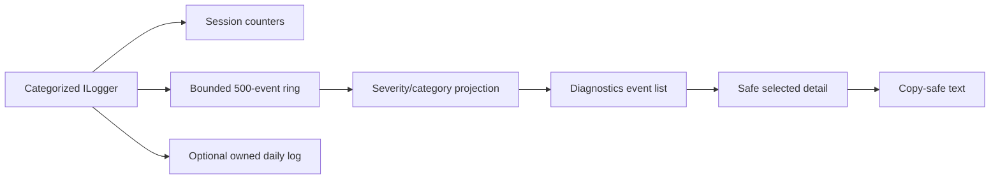
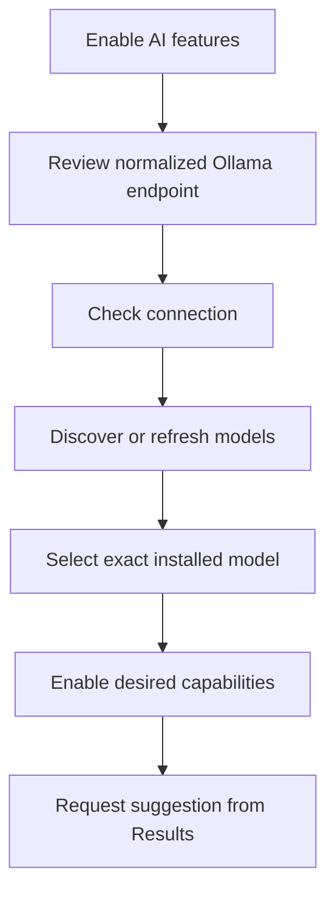
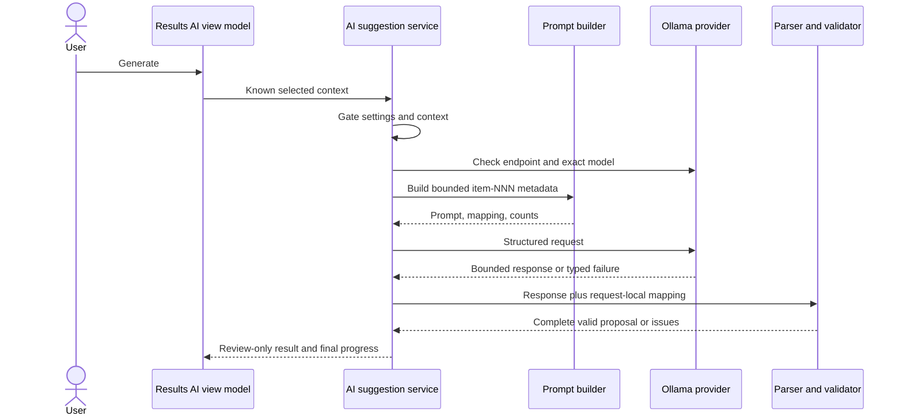
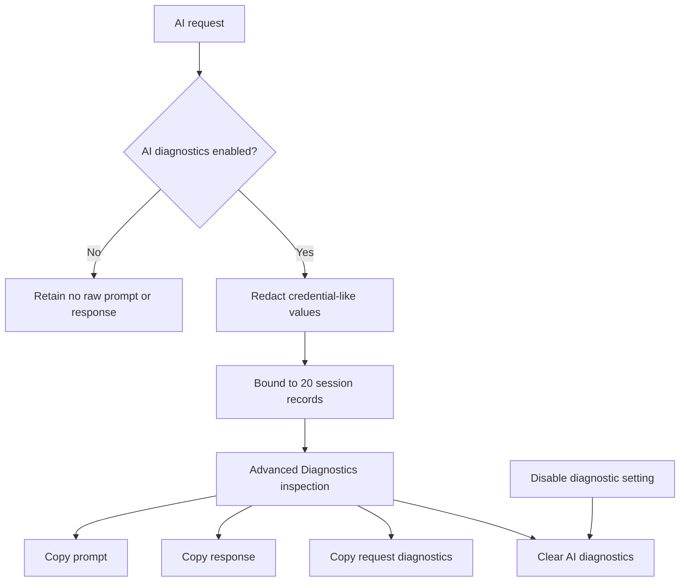
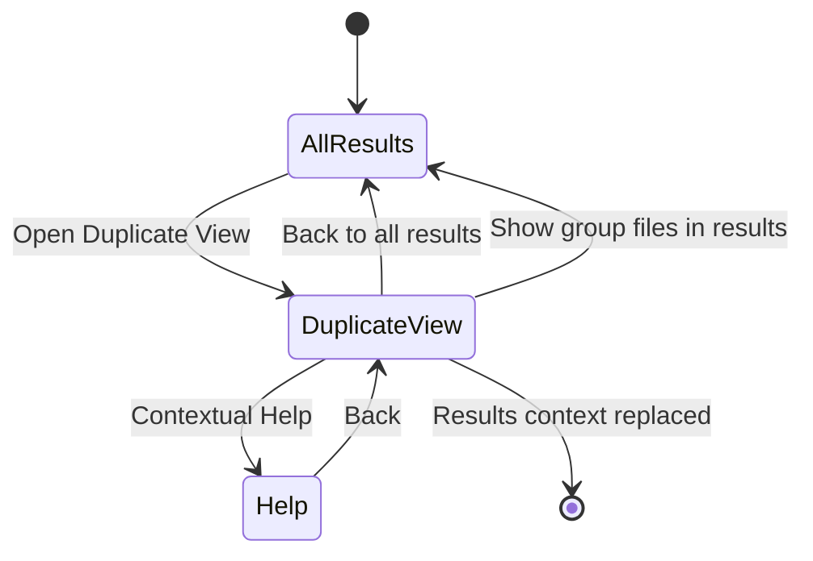

# Specification 047 - v0.9.1 Correction, Reliability, and Usability Pass

| Field | Value |
| --- | --- |
| Component | Diagnostics, optional Ollama integration, Settings, Help, Catalog Search, Results and Duplicate View |
| Target release | v0.9.1 corrective pass |
| Depends on | Specification 046 and the completed v0.9.1 implementation |
| Status | Implemented; automated validation complete, manual GUI verification pending |

## 1. Objective and manual-test findings

This corrective pass keeps the v0.9.1 safety boundary while making the implemented features understandable and reliable during ordinary GUI use. It is not v0.9.2 and does not authorize automatic file mutation.

Manual testing and source inspection found these material gaps:

- Diagnostics exposes logging totals but retains no inspectable session events.
- the reusable `HttpClient` has its framework default timeout while request code adds a second timeout; values above 100 seconds therefore cannot work reliably;
- endpoint paths such as `/api`, `/api/tags`, or `/api/generate` can be combined into invalid doubled API paths;
- endpoint testing and model discovery are presented as one provider operation, selected-model availability is not represented, and discovery may silently choose the first model;
- essential endpoint, model, connection, discovery, and timeout controls incorrectly require Advanced mode;
- the timeout contract stops at 120 seconds and an integer-bound text box gives weak entry feedback;
- AI requests have only a generic busy state and no typed stage history;
- folder prompts use application source identifiers directly, do not report included/omitted counts, and require each supplied item only “at most once” rather than exactly once;
- raw AI request inspection is unavailable;
- user-facing statuses are ordinary text with inconsistent severity communication;
- Catalog Search mixes saved-query management above primary search, repeats no-result text, and contains a duplicate status assignment;
- internal contextual Help and topic routing do not exist;
- Settings visibility changes can resize content around a focused control and trigger `BringIntoView`, producing perceived scroll jumps;
- the exact-duplicate surface uses technical terminology, fixed minimum widths, unstructured paths, and no safe comparison launcher.

## 2. Scope and non-goals

In scope are bounded session diagnostics, reliable Ollama endpoint and timeout handling, explicit setup/readiness, typed progress, exact metadata-only prompts using request-local IDs, opt-in raw AI diagnostics, consistent status presentation, simplified Catalog Search, internal contextual Help, Settings scroll stability, and a responsive Duplicate View with non-destructive external opening.

Out of scope remain plugins, complete localization, packaging, automatic duplicate deletion, automatic AI actions, bulk file mutation, content upload, broad provider frameworks, and v1.0 release engineering.

## 3. Safety and privacy invariants

- AI and every AI capability remain default-off and service-gated before provider use.
- Rename and folder prompts contain bounded textual metadata only: exact filenames, extensions, deterministic category, optional size, and request-local identities. No bytes, extracted text, image data, file contents, or absolute paths are sent.
- Suggestions remain untrusted, validated, review-only data. No acceptance action invokes a filesystem mutation service.
- AI request diagnostics are default-off, session-only, bounded to 20 records, and cleared when disabled. Prompt and response capture is redacted and never written to ordinary logs.
- External opening uses direct known paths through an abstraction, never a constructed shell-command string. OpenSorSe does not modify an opened file.
- Duplicate deletion and automatic launch of an excessive number of files are not introduced.

## 4. Diagnostics redesign

`ILoggingService` shall expose a newest-first immutable snapshot of a bounded 500-event process-session buffer. Each event contains UTC timestamp, severity, category, bounded summary, optional event identifier, and a bounded safe exception summary. Normal projection omits stack traces. Logging to the existing owned daily files remains independent.

Diagnostics uses a responsive master-detail layout with severity and category filters, selection, refresh, empty state, and **Copy diagnostic details**. Counts continue to come from logging statistics. Operation History stays a separate page. Scan warnings remain on Results. AI request diagnostics appear in a clearly separate advanced section only when AI, Advanced mode, and the diagnostic opt-in are active.

Faults in capture, filtering, clipboard, or daily-file output must not break application workflows.

## 5. Ollama setup and transport reliability

Endpoint normalization accepts only HTTP(S) endpoints without credentials, query, or fragment; strips known Ollama API suffixes; preserves a supported base path; and produces one trailing-slash base URI used consistently by tags and generation requests. The exact model identifier returned by `/api/tags` is preserved ordinally.

The DI-owned `HttpClient` uses an infinite client timeout. Every Ollama operation uses exactly one linked request cancellation source with a finite user timeout from 5 through 300 seconds. Caller cancellation maps to cancellation; expiry of the request token maps to timeout. Bounded HTTP error bodies are parsed for safe classification without placing raw bodies in ordinary UI or logs.

Normal AI settings, visible whenever AI is enabled, contain endpoint, **Check connection**, **Discover models** / **Refresh models**, installed-model selection, selected-model availability, effective timeout, and capability switches. Discovery never silently replaces a configured model. An unavailable configured model remains visible and explicitly marked unavailable.

Generation performs local gates first, then a bounded model-availability preflight against the same normalized endpoint, then the structured non-streaming `/api/generate` request with a bounded keep-alive. The provider reports concrete HTTP, timing, normalized-endpoint, and size metadata to application diagnostics. No automated test requires Ollama.

## 6. Prompt architecture, progress, and validation

`AiPromptBuilder` deterministically sorts included records and assigns `item-001`, `item-002`, and so on. The prompt package retains a private application mapping from request-local ID to known result identity. Responses refer only to request-local IDs, which are mapped back only after complete validation.

Folder input publishes total, included, and omitted counts. Every included item must be assigned exactly once in a suggestion response. Rename uses `item-001`, preserves the extension, excludes sibling conflicts, and supports an explicit no-change result. Both prompts require strict JSON without Markdown.

Typed progress stages are: checking settings, connecting, validating model, preparing metadata, sending, waiting, receiving, validating, ready, cancelled, timed out, and failed. The ViewModel prevents concurrent same-context requests, propagates cancellation, publishes elapsed time at stage changes/completion, and clears stale progress/proposals when Results context changes.

## 7. AI request diagnostics

A singleton session store retains at most 20 completed request records when `Enable AI request diagnostics` is active. Records include capability, normalized endpoint, exact selected model, timeout, stage history, times/duration, outcome, HTTP status, failure kind, request/response sizes, validation outcome/issues, bounding counts, redacted exact prompt, and redacted exact response.

The UI states: **AI request diagnostics may contain filenames and relative folder metadata.** It never presents authorization headers, credentials, environment variables, file contents, or unrelated settings.

## 8. Consistent status presentation

A reusable immutable status model and Avalonia view represent Information, In progress, Success, Warning, and Error with a textual label plus message; presentation never relies on color alone. Long messages wrap. Optional technical detail is separate. Settings, AI, Diagnostics, Catalog Search, Duplicate View, and launcher failures use this model without recreating their pages.

## 9. Catalog Search correction

The page is reordered into **Search the catalog** followed by **Saved searches**. Search controls, one status, one result count/empty state, result selection, and snapshot opening form the primary workflow. Clear query resets selection and results. The saved-query section groups create, run, rename, remove, and two-step clear-all actions; refresh is deemphasized because mutations republish the collection immediately. Renaming reuses the existing store model/format and preserves IDs, creation times, and compatibility. Removing or clearing definitions explicitly does not change files, snapshots, tags, or catalog entries.

## 10. Contextual Help

Help is a regular navigation destination immediately above About. Help topics are centralized immutable models with purpose, reads, changes, non-changes, workflow, controls, empty states, errors, safety notes, and related topics. Page ViewModels expose a common keyboard-accessible Help command configured by the shell. Results dynamically routes to Results, Duplicate View, or AI Suggestions as appropriate.

Unknown topics fall back to Help overview. Hidden advanced destinations cannot be restored by Back; Dashboard is the safe fallback.

## 11. Settings view lifetime and scroll stability

The shell already owns one long-lived `SettingsViewModel` and one persistent view tree; provider status updates do not require page replacement. The observed jump is caused by visibility-driven layout changes around the focused control, followed by Avalonia focus `BringIntoView`. The Settings view shall capture its `ScrollViewer.Offset` before feature-section visibility changes and restore the nearest valid offset after layout settles, without fixed offsets or ViewModel recreation. Non-structural status changes never touch scroll state. A lifetime regression test verifies the shell retains the same Settings instance; manual UI verification covers actual offsets.

## 12. Duplicate View and safe external opening

User-facing **Exact duplicates** becomes **Duplicate View**. Results provides **Open Duplicate View**, and Duplicate View provides **Back to all results**. The duplicate filter remains an ordinary Results filter and is documented as distinct from grouped review.

Group cards show “N identical files,” per-file size, and “Possible space saved by keeping one copy,” calculated as common size multiplied by `count - 1`. Selected-group rows contain a checkbox, filename, shortened parent path, full-path tooltip, size, **Open file**, and **Open containing folder**. Layout wraps/collapses without page-wide minimum widths or horizontal scrolling.

`IExternalFileLauncher` validates direct known paths and asynchronously uses the platform shell with argument-safe `ProcessStartInfo`. The ViewModel permits **Open both files** only for two-member groups and **Open selected files** for larger groups, caps one action at five, continues after individual failures, supports cancellation, and reports partial success. Tests use a fake; automated tests never launch an external process. Selection survives harmless UI updates and is cleared when the snapshot identity changes.

## 13. Dependency injection and compatibility

DI adds bounded diagnostic stores, Help models, clipboard abstraction, and external launcher while retaining the provider-neutral application boundary. JSON settings remain backward compatible because missing `RequestDiagnosticsEnabled` defaults to false and timeout defaults remain valid. Existing model identifiers and saved searches are preserved. No persistent raw AI diagnostic format is introduced.

## 14. Testing strategy

Tests cover session event retention/projection/filter/copy; all endpoint suffixes; exact model identity; connection/discovery/missing selection; 5 and 300-second bounds; client/request timeout behavior; timeout versus caller cancellation; progress ordering and cleanup; deterministic request-local IDs; exact filenames/no content; included/omitted counts; exact-once assignment; diagnostic capture/redaction/clear/retention; status accessibility metadata; Catalog Search state/rename/clear; Help order/routing/back/fallback; Settings lifetime; Duplicate View summaries/navigation/path projection/selection; and fake-launcher success, missing paths, caps, cancellation, unknown paths, failures, and partial success.

All existing scan, Results, catalog, saved-search, tag, snapshot, rules, AI-gating, response-validation, and filesystem-safety tests remain mandatory.

## 15. Acceptance and manual verification

Acceptance requires all brief criteria to be implemented on `v0.9.1`, current-source restore/build/test validation, clean XAML compilation and DI construction, no tracked artifacts/secrets/personal paths, and local corrective commits without changing `main` or creating v0.9.2.

Manual verification follows the updated repository checklist and specifically exercises Diagnostics inspection/copy, AI setup without Advanced mode, 300-second entry, unavailable Ollama/model, progress/cancellation, opt-in raw request inspection/clear, all status severities, simplified catalog search, contextual Help from every major page, Settings scrolling, Duplicate View resizing/navigation, safe external opening/partial failure, and a before/after user-file manifest confirming no automatic mutation.

## 16. Implementation outcome

The correction pass is implemented without expanding the v0.9.1 mutation boundary. Automated coverage includes the diagnostic buffers, endpoint normalization, exact model handling, progress and raw diagnostic gating, prompt identity/count contracts, whole-response validation, Catalog Search state, Help routing, Settings lifetime, production dependency-graph construction, and Duplicate View launcher safety. The redirected-artifact Debug build completes with zero warnings and the full 453-test suite passes. The host still denies writes to pre-existing in-place `obj` files, so the repository-local ignored `.artifacts` route is the validated build path in this environment. The remaining release gate is the manual Avalonia/Ollama checklist.
