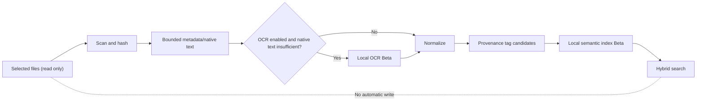
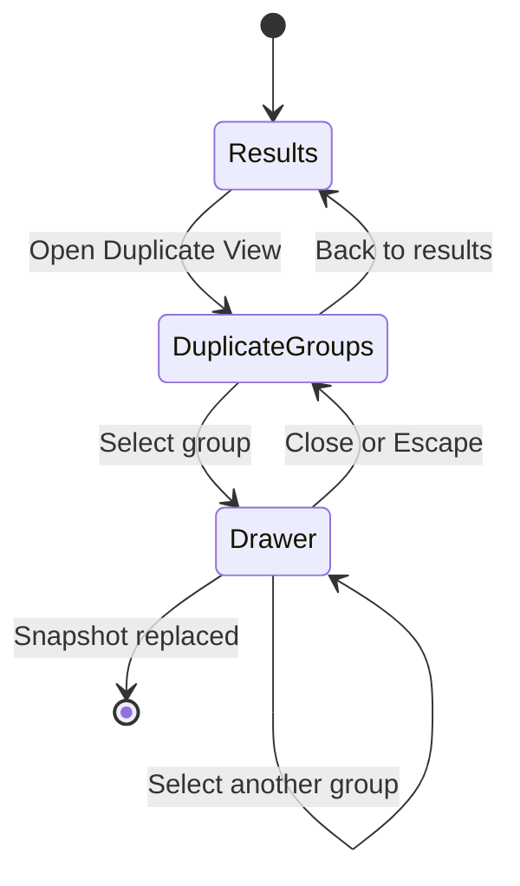
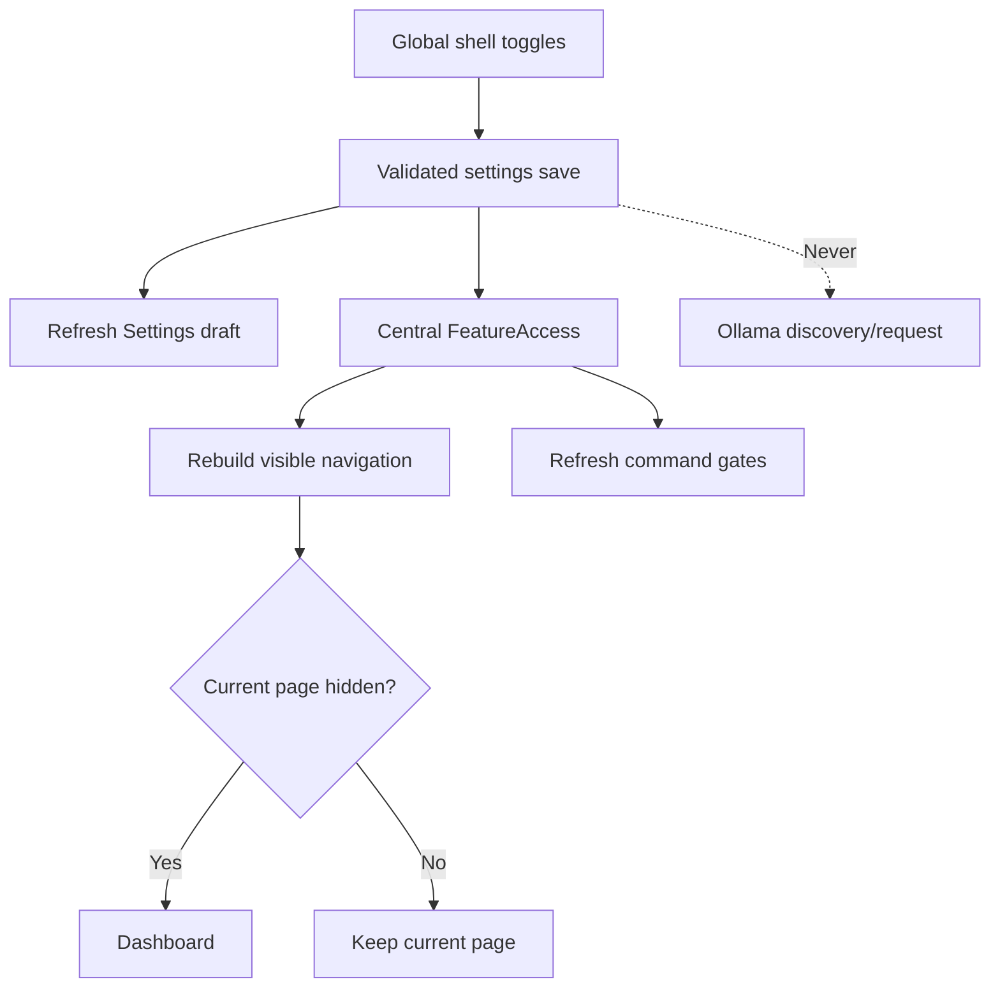
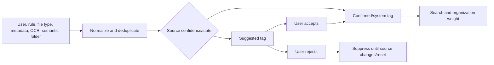
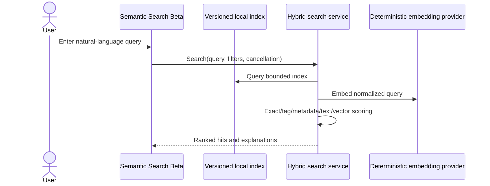
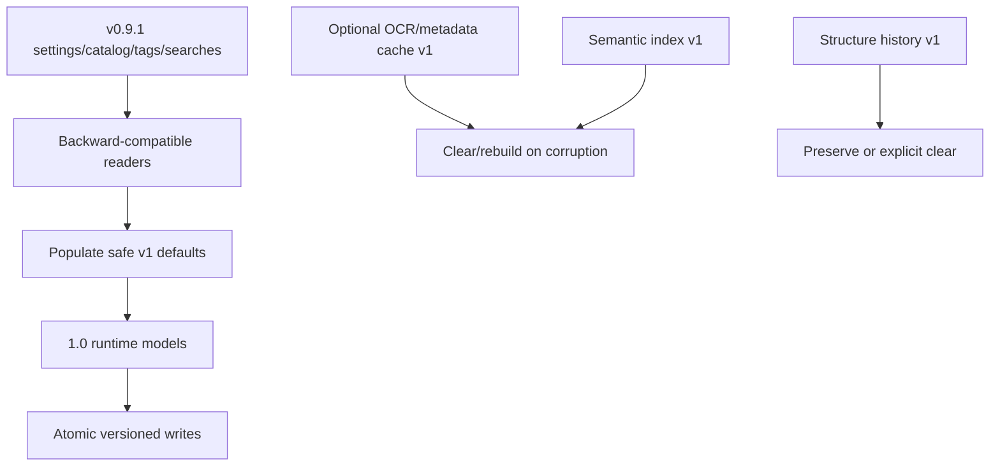
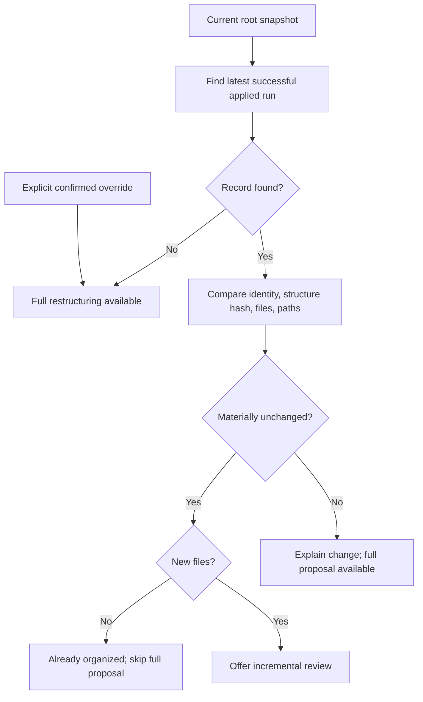
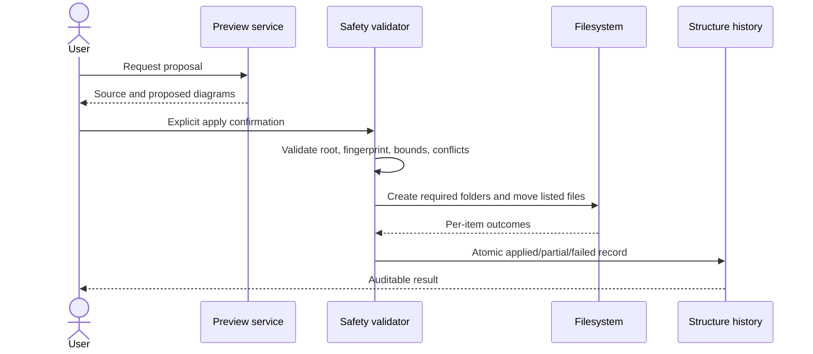
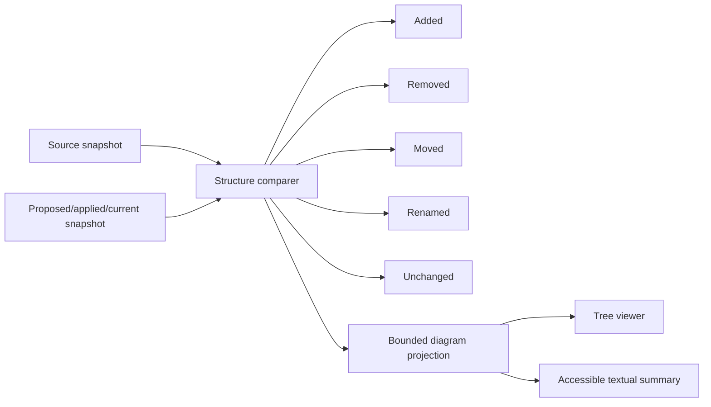
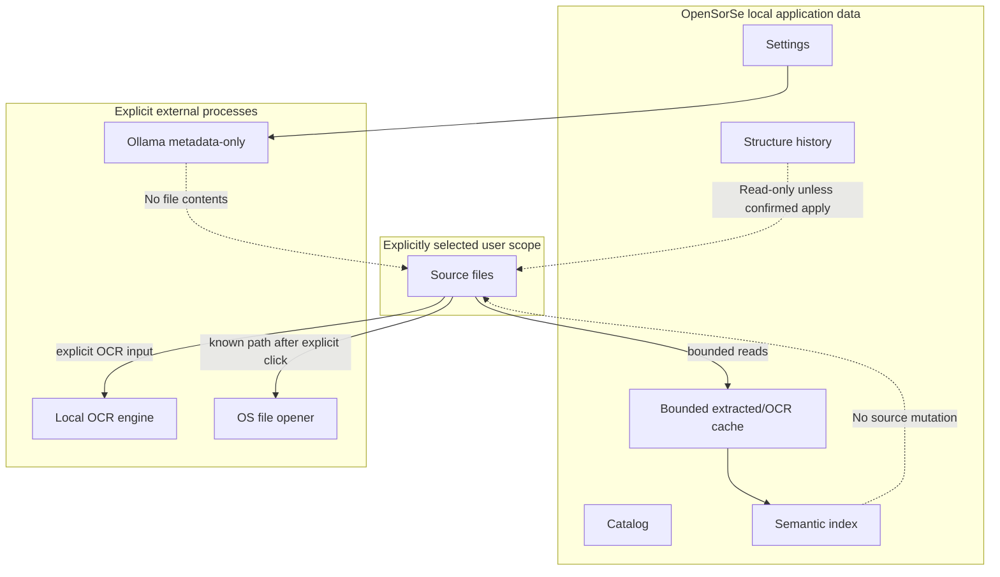

# Specification 048 - OpenSorSe 1.0.0 Integrated Release

| Field | Value |
| --- | --- |
| Components | Results, Duplicate View, shell, extraction, tags, search, restructuring, history, diagrams, persistence |
| Target | OpenSorSe 1.0.0 release candidate |
| Baseline | v0.9.1 specifications 046-047 and existing scan/catalog architecture |
| Status | Approved for implementation on `v1.0` |

## 1. Objective

Deliver a coherent local-first desktop release that can inspect file metadata, optionally OCR supported local images, create a bounded local hybrid search index, explain results, and retain reviewable folder-structure history. The release also corrects Results scrolling, presents duplicate details in a right drawer, and exposes AI/Advanced switches globally.

## 2. Scope and maturity

Implemented stable scope comprises the fixed Results toolbar, Duplicate drawer, global toggles, defensive metadata extraction, provenance tags, versioned local stores, repeat protection, history, comparison, diagrams, migrations, Help, and diagnostics.

OCR and Semantic search are feature-level Beta. OCR depends on truthful local engine capability. Semantic quality may evolve and its index may require future rebuilding. Experimental post-1.0 areas include model-based embeddings and richer entity inference. Plugins, cloud content providers, silent background organization, automatic duplicate deletion, and broad packaging remain deferred.

## 3. Safety invariants

- Reads are bounded, cancellable, and local.
- OCR, extraction, indexing, AI, history, and diagrams never mutate source files.
- Raw content is excluded from normal logs, AI prompts, catalog snapshots, and AI diagnostics.
- Ollama continues to receive metadata-only rename/folder prompts.
- Optional cache/index corruption cannot block scanning.
- Restructuring defaults to preview. Apply requires explicit confirmation, remains inside one validated root, never overwrites or deletes, and records every outcome.
- External opening continues through the validated launcher abstraction.
- AI and Advanced default off. OCR and semantic indexing also default off.

## 4. Results and Duplicate View

Results uses a root grid with a fixed header/filter/status region, an independently scrolling virtualized result list, and a fixed paging footer. No outer vertical `ScrollViewer` contains the toolbar. Controls use wrapping panels and retain ViewModel instances/focus state.

Duplicate View keeps its group list visible and independently scrollable. Selecting a group opens a non-modal right drawer. The drawer has a bounded responsive width, accessible name, Close/Escape action, file selection, safe launcher actions, launch status, and safety text. Snapshot replacement closes the drawer and cancels launcher work.

## 5. Global feature toggles

The shell owns committed AI and Advanced state. Two dedicated checkboxes remain below page navigation and above Help/About. A shell change persists immediately, refreshes Settings, recalculates feature navigation, cancels newly disabled work, and falls back to Dashboard if the active destination becomes hidden. No provider call is initiated.

## 6. Metadata and OCR

`IMetadataExtractor` implementations publish bounded typed fields with provenance, confidence, and warnings. `IMetadataExtractionPipeline` combines filesystem facts, safe embedded metadata, optional native text, and optional OCR. `IMetadataNormalizer` normalizes whitespace, dates, language identifiers, and keywords without upgrading uncertain values.

`IOcrEngine` reports capability and engine identity. `IOcrService` applies settings, native-text skip rules, extension/file/page/text/time bounds, cancellation, cache reuse, source-fingerprint invalidation, and result normalization. OCR states are Pending, Processing, Completed, Skipped, Failed, Partial, and NotIndexed. The Tesseract adapter is optional and never required by tests.

## 7. Tag derivation

Tags include source, state, confidence, timestamps, file identity, source fingerprint, and bounded provenance. User and existing accepted tags are confirmed. Generated metadata/OCR/semantic/folder tags are suggested. Rejected suggestions are suppressed for the same source fingerprint.

## 8. Semantic search Beta

`ISemanticIndexer` transforms bounded `SemanticDocument` values into persisted records with source fingerprints and deterministic feature-hashing vectors. Incremental synchronization updates changed files and removes absent files. `ISemanticSearchService` tokenizes the query once and combines explicit signals with cosine similarity.

Ranking order gives greatest weight to exact filenames and confirmed user tags, followed by metadata/path/date/category, vector similarity, and bounded native/OCR text. Suggested or low-confidence OCR tags cannot outrank confirmed facts by themselves. Every hit lists matched signals; embeddings are never displayed.

## 9. Persistence

| Store | Schema | Bound | Recovery |
| --- | --- | --- | --- |
| `settings.json` | backward-compatible properties | 1 MiB | safe defaults/preserve invalid file |
| `catalog.json` | schema 2 read; optional v1 fields absent safely | existing limits | preserve malformed data |
| `content-cache.json` | 1 | 2,000 entries / bounded text | clear/rebuild |
| `semantic-index.json` | 1 | 10,000 documents / bounded vectors | clear/rebuild |
| `structure-history.json` | 1 | 250 runs / bounded snapshots | preserve/explicit clear |

## 10. Restructuring and repeat protection

A structure snapshot stores bounded relative folders/files and stable fingerprints, never file contents. A preview records source/proposed snapshots but cannot activate repeat protection. Apply validates the unchanged preview, root identity, current source files, relative destinations, conflicts, and confirmation token. It creates only required in-root directories and moves only listed files; failures are recorded and no destination is overwritten.

After an applied success, `IRestructuringProtectionService` compares root identity, structure hashes, file identities, and relative paths. It returns FirstRun, AlreadyOrganized, NewFilesOnly, MateriallyChanged, PreviousIncomplete, or OverrideRequired. Only successful applied records suppress a redundant full proposal.

## 11. Structure history and diagrams

Structure History is an advanced non-AI navigation page near catalog comparison and operation history. It filters runs by root, time, state, preview/applied, and current-match. Selection exposes source, proposed, applied, and comparison projections.

The diagram is a bounded lazy tree with folder aggregation, initial-depth limits, search, counts, status labels, and a textual fallback. Added, removed, moved, renamed, unchanged, failed, and skipped are conveyed by text and icons, not color alone.

## 12. Privacy boundaries

## 13. UI, MVVM, and DI impact

- Results and Duplicate drawer reuse existing ViewModels and central status presentation.
- New Semantic Search and Structure History pages are shell-owned long-lived ViewModels.
- Settings adds OCR, metadata, semantic index, privacy, and storage sections while retaining scroll restoration.
- Services are constructor-injected; no service locator or blocking UI calls are introduced.
- Background work reports typed progress and honors cancellation.

## 14. Compatibility and migrations

Missing v1 settings default off. Existing catalog schema 1/2, tags, saved searches, AI decisions, and v0.9.1 settings remain readable without destructive rewriting. New stores are absent by default. Optional cache/index corruption yields a controlled rebuild state. Structure history absence means no prior operation and never activates repeat protection.

## 15. Testing

Tests use fake OCR engines, deterministic embeddings, in-memory/temporary stores, and fake launchers. Coverage includes layout structure, drawer state, shell synchronization, metadata readers, OCR bounds/cache/cancellation, tag provenance, hybrid ranking, incremental index changes, corrupt-index recovery, restructuring state/protection/apply safety, history migration, diagram comparison/aggregation, XAML, DI, and all v0.9.1 regressions.

## 16. Practical limits

- Metadata/OCR text per file: 64 KiB normalized.
- OCR: 50 MiB file, 25 pages, 120 seconds, parallelism 1 by default.
- Content cache: 2,000 records.
- Semantic index: 10,000 documents, 256 feature-hash dimensions.
- Search results: 200.
- Structure history: 250 runs, 4,000 nodes per snapshot.
- Diagram initial projection: 500 visible nodes with folder aggregation.
- Restructuring apply: 500 file moves per confirmed operation.

## 17. Acceptance

Acceptance requires version 1.0.0, current-source build/test success, XAML and DI validation, backward-compatible migrations, no tracked runtime data, complete documentation, local commits on `v1.0`, a clean tree, unchanged `main`, and manual GUI/OCR/cross-platform review before integration.
