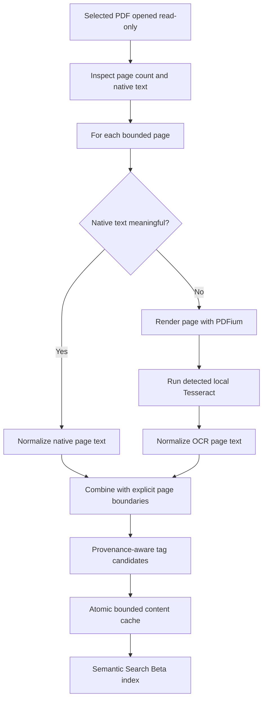
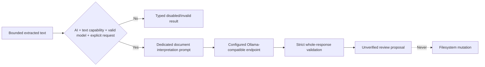

# Specification 049 - OpenSorSe 1.0 Final Product Completion

| Field | Value |
| --- | --- |
| Components | PDF OCR, OCR capability/settings/cache, optional AI text interpretation, semantic ranking, tags, UI polish, migration, licensing |
| Target | OpenSorSe 1.0.0 final manual-validation candidate |
| Baseline | Completed specification 048 implementation at commit `4eb78b3` |
| Status | Approved for implementation on local `v1.0` |

## 1. Objective

Complete the product-facing 1.0 boundary without adding packaging, plugins, cloud indexing, autonomous AI file control, or another feature branch. The pass closes scanned-PDF OCR, makes dependency licensing machine-checkable, hardens OCR/Tesseract behavior, improves deterministic search quality, and finishes the usability, recovery, accessibility, Help, and validation work required before packaging.

## 2. Scope

Delivered scope:

- Managed PDFium page rendering through the MIT-licensed `PDFtoImage` wrapper.
- Page-level native-text quality decisions and OCR only for insufficient pages.
- English/German Tesseract capability and language-pack validation.
- Bounded OCR settings, progress, cancellation, cache fingerprints, cleanup, diagnostics, and recovery.
- A separately disabled AI capability for bounded extracted-text interpretation.
- Improved German/English query normalization, exact/tag priority, OCR damping, and explanations.
- Provenance preservation, rejection suppression, safe tag merging, and source-change invalidation.
- Results, Duplicate drawer, shell, Settings, Structure History, Help, and accessibility polish.
- Representative migration, stress, license, OCR, search, and UI regression tests.

Out of scope:

- Installer, executable packaging, automatic dependency installation, cloud OCR, OCR write-back, automatic tag acceptance, AI transcription, general document agents, and autonomous filesystem changes.

## 3. FOSS dependency decision

`PDFtoImage` 5.2.1 is selected for rendering because it is MIT licensed, targets .NET 8, uses PDFium native binaries published through the `bblanchon.PDFium.*` packages, and uses SkiaSharp already present through Avalonia. PDFium and the binary-distribution packages are permissively licensed; their notices are retained in the dependency inventory and third-party notice file.

Tesseract remains an externally detected Apache-2.0 executable. OpenSorSe does not download or bundle Tesseract or language packs. `AvaloniaUI.DiagnosticsSupport` is removed because its resolved package manifest contains no license declaration; release diagnostics continue through OpenSorSe's own FOSS logging and diagnostic views.

The machine-readable inventory must contain every resolved direct/transitive package, purpose/scope, upstream location, license, notice location, bundling status, and redistribution note. Validation fails for absent inventory entries, unknown licenses, non-commercial/source-available licenses, AGPL, or unreviewed strong-copyleft dependencies. This is an engineering inventory, not legal advice.

## 4. PDF document-text flow

`IPdfTextExtractor` returns page count and bounded page records. `IPdfPageRenderer` renders one numbered page into a uniquely named application temp workspace. `IPdfOcrCoordinator` applies page-level decisions, calls `IOcrEngine` for rendered images, deletes each image after use, and deletes the workspace on success, failure, timeout, or cancellation. `IDocumentTextPipeline` selects PDF coordination or the ordinary metadata/OCR path.

Each page records `NativeText`, `Ocr`, `NativeAndOcrFallback`, `Skipped`, or `Failed`; confidence, warnings, engine/rasterizer identity, and duration remain optional/bounded. Whole-document results distinguish completed, partially completed, unavailable, failed, timed out, and cancelled.

## 5. Page-level decision policy

Native text is sufficient only when normalized text:

- contains at least 32 meaningful characters;
- contains at least 12 letters/digits;
- has replacement/control noise below 10%;
- is not only punctuation or repeated glyph noise.

The default policy uses native text without OCR. Empty, short, corrupt, or image-only pages are rendered and OCRed. Explicit reprocessing may OCR all pages but still preserves native/OCR provenance. Page and text limits are deterministic.

Encrypted/password-protected, malformed, oversized, or over-page-limit documents return controlled results. No password guessing or security bypass is attempted.

## 6. Rendering and temporary storage

Rendering defaults to 240 DPI with a maximum 4,096-pixel edge. Allowed DPI is 150-300 and maximum edge is 1,024-8,192 pixels. PDFium calls are serialized because the selected wrapper documents the native renderer as non-thread-safe.

Temporary PNG files:

- are created below `Path.GetTempPath()/OpenSorSe/ocr`;
- use a unique per-document directory and page filename;
- are capped by page count and a configured aggregate byte limit;
- are deleted immediately after recognition and again in a final cleanup;
- never share a directory with unrelated data;
- are cleaned on startup when owned, stale, and safely named.

## 7. Tesseract capability

The engine resolves either a validated configured executable or `tesseract` from `PATH`, never a shell command. Detection runs `--version` and `--list-langs`, bounds both streams, validates the configured `eng`, `deu`, or `+` combination, and caches only the successful capability snapshot. Recheck invalidates the cache.

Exit codes, missing executable/language, timeout, cancellation, empty/oversized output, and process errors map to typed user-safe failures. Arguments use `ProcessStartInfo.ArgumentList`. Raw OCR text and full paths are excluded from ordinary diagnostics.

## 8. Settings and cache

Safe defaults remain:

- OCR disabled.
- Native text preferred.
- Languages `eng`.
- 25 pages, 50 MiB input, 120 seconds, 240 DPI, 4,096-pixel edge.
- 64 KiB combined OCR text.
- 256 MiB temporary-storage limit.
- AI text interpretation disabled.
- Semantic Search Beta disabled.

Cache identity includes source size/time, source fingerprint, OCR schema, engine/version, language set, rasterizer/version, DPI, edge/text/page limits, and native-text policy. A mismatch reprocesses only the affected file. User-created/accepted tags survive cache invalidation; generated tags are regenerated against the new source fingerprint. Stores remain atomic, bounded, clearable, and recoverable.

## 9. Optional AI extracted-text interpretation

The `DocumentTextInterpretation` capability requires:

1. Global AI enabled.
2. `Allow local AI to analyze extracted document text` enabled.
3. Valid configured endpoint/model.
4. Explicit user request for one known content record.
5. Bounded page/character context.

The prompt contains normalized text only, never a file or binary payload, and clearly identifies native/OCR provenance. A non-local/private endpoint warning is shown before enablement. Strict JSON returns only suggested document type, title, tags, dates, issuer, folder, confidence, and bounded explanation. Every value remains unverified and review-only; exact identifiers, legal/financial transcription, and filesystem execution are forbidden.

## 10. Semantic and tag quality

Normalization applies Unicode decomposition/diacritic folding, invariant casing, punctuation/extension splitting, underscore/hyphen splitting, date/year preservation, and conservative English/German suffix variants. Exact filename and confirmed user tags rank above all inferred signals. Metadata/path/category follow; native text is bounded; OCR matches are down-weighted; cosine similarity cannot independently dominate.

Explanations name concrete signals and Advanced mode may show component scores without exposing vectors. Rejected tags contribute no ranking weight. Duplicate normalized tags merge with confirmed/user provenance taking precedence.

## 11. UI and accessibility

- Results keeps one ViewModel, fixed controls, sensible wrap widths, tooltips for paths, and one result count.
- Duplicate drawer uses labelled close/selection/launch controls, text statuses, bounded width, Escape, and safe reset.
- Shell switches remain compact and non-navigation-like; disabling AI cancels work and clears transient previews/diagnostics.
- OCR Settings shows engine/rasterizer readiness, detected versions/languages, selected languages, privacy guidance, recheck/test/cache actions, and validation messages.
- Structure workflows label preview versus apply, explain repeat protection, and state that history/diagrams are not undo.
- Help includes native/mixed/scanned PDF behavior, dependencies, languages, cache, errors, optional AI text interpretation, provenance, privacy, and troubleshooting.

Status is never color-only. Major controls have accessible names/tooltips and coherent keyboard order. Layouts wrap at narrow widths and retain text alternatives.

## 12. Recovery, migration, and performance

Existing v0.9.1 settings/catalog/tags/searches/AI decisions and 1.0 schema-1 stores remain readable. New settings use conservative defaults. Content records missing the extended OCR fingerprint/page fields are stale-but-readable and are reprocessed only when indexing runs. Corrupt optional stores yield diagnostics and an empty/rebuildable state.

Stress tests use generated in-memory/temporary fixtures for 1,000/10,000 records, cancellation, large tag/duplicate/diagram sets, many OCR failures, mixed multipage documents, and unchanged-file cache hits. Tests assert bounds and completion/cancellation behavior; they do not publish unsupported performance guarantees.

## 13. Acceptance

Acceptance requires real PDFium rendering, page-level mixed-PDF coordination, validated Tesseract language detection, safe cleanup/cache behavior, separate AI text gating, FOSS inventory checks, current-source Debug/Release builds, complete automated tests, clean static inspections, logical local commits, unchanged `main`, and manual OCR/UI/platform verification before packaging.
