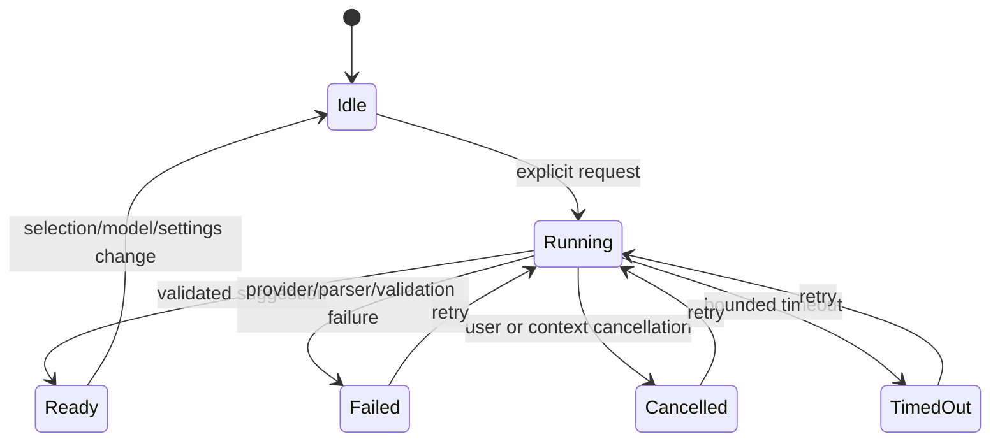
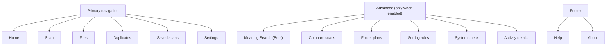
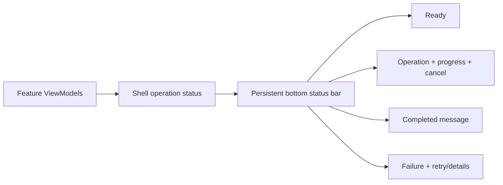

# OpenSorSe v1.0 Release-Candidate UX and AI Hardening

| Field | Value |
| --- | --- |
| Branch | `v1.0` |
| Status | Implemented; automated validation complete, manual GUI/Ollama verification pending |
| Safety | No new filesystem mutation; AI remains explicit, validated, and review-only |

## Objective

Refine the completed v1.0 implementation into a coherent, lightweight desktop experience without removing underlying capabilities or weakening source-file safety. The pass focuses on predictable local-AI recovery, progressive disclosure, plain-language navigation, a consolidated Files and Saved scans experience, visible Meaning Search, shared operation status, and a warmer accessible visual identity.

## Current-state assessment

- The immutable results, catalog, semantic-search, OCR, AI-validation, and history services are already implemented.
- Primary navigation currently exposes too many implementation-oriented destinations.
- Saved catalog, catalog search, and snapshot comparison are presented as unrelated concepts.
- The Results selection setter updates details and extracted metadata but does not update the AI suggestion context. AI context is refreshed only after a results query, which can leave the rename command disabled after a visible row selection.
- Settings has connection and model-discovery commands, but readiness is not represented as a complete user-facing state machine.
- Cancellation uses operation versions correctly, but cancellation-source ownership and retry status need stronger guarantees.
- Views rely almost entirely on stock Fluent resources and repeat page-local spacing, borders, help buttons, and status text.

## Scope

1. Bind selected Files rows immediately to review-only AI actions.
2. Explain every disabled rename state.
3. Make AI success, failure, timeout, malformed-output, and cancellation paths return to an idle/retryable command state.
4. Add explicit local-AI readiness and retry behavior.
5. Persist and validate the chosen model; ensure each request uses the current saved model.
6. Reduce primary navigation to Home, Scan, Files, Duplicates, Saved scans, and Settings.
7. Place specialist pages in an Advanced section and Help/About in the footer.
8. Present Saved scans, Search saved scans, and Compare scans as one local area.
9. Expose Meaning Search as a clear Beta search mode from Files while preserving its existing dedicated implementation.
10. Introduce a persistent global status bar and shared visual resources.
11. Replace permanent explanatory paragraphs with concise copy and contextual help where practical.
12. Add regression tests and update v1.0 documentation.
13. Replace placeholder shell/window artwork with the official compact OpenSorSe identity and tagline.
14. Add a responsive pointer/keyboard-resizable Files details divider with bounded persisted ratio.
15. Polish Files rows and add keyboard-resizable shared table columns.

## Out of scope

- Packaging, installers, automatic updates, or publishing.
- New AI providers or a generic provider plug-in framework.
- Automatic AI-driven file mutation.
- Automatic launching of Ollama. A future opt-in start action is deferred until executable discovery, process ownership, and cross-platform behavior can be made reliable.
- Replacing the deterministic semantic index with an external vector database.
- Renaming internal catalog, snapshot, semantic, or ViewModel types solely for marketing copy.

## User stories

- As a person reviewing files, selecting a row immediately enables eligible rename suggestions or tells me exactly why it cannot.
- As a person using local AI, I can cancel, retry, reconnect, or change models without restarting OpenSorSe.
- As a new user, I can find the six primary workflows without understanding implementation terms.
- As an experienced user, I can enable Advanced mode without losing the simple primary workflow.
- As a keyboard user, I can reach navigation, search, filters, details, help, and status actions in a predictable order.
- As a privacy-conscious user, I can see that suggestions are local, optional, unverified, and never applied automatically.

## Functional requirements

### AI selection and action state

- `ResultsViewModel.SelectedRow` must synchronously update the selected `ResultFile` in `AiSuggestionsViewModel`.
- AI availability text must distinguish no selection, global AI disabled, rename capability disabled, missing service, missing model, service not ready, operation running, unsupported item, and retryable failure/cancellation.
- Command gates remain authoritative; explanatory text supplements rather than replaces them.

### AI operation lifecycle

- One operation owns one cancellation source.
- Completion clears the active reference, disposes the source, sets busy false, and refreshes commands.
- Cancellation is idempotent and cannot publish a stale result.
- A selection or settings change cancels the old operation and leaves the new context retryable.

### Ollama readiness

User-facing readiness states:

| State | Meaning |
|---|---|
| Not configured | AI is disabled, endpoint invalid, or no model is selected |
| Server unavailable | Configuration is valid but the endpoint cannot be reached |
| Server available | Endpoint responds; model discovery/selection is incomplete |
| Model missing | The selected model is absent from the discovered list |
| Ready | Endpoint responds and exact selected model is installed |
| Running | An explicit check, discovery, or suggestion is active |
| Failed | Latest request failed safely and can be retried |
| Cancelled | Latest request was cancelled and can be retried |

“Retry connection” re-runs the bounded connection/discovery sequence. OpenSorSe does not start an external process automatically.

### Model switching

- Model selection remains persisted through `AiSettings.SelectedModel`.
- Changing the draft model invalidates prior readiness until validation.
- Saving a new model makes it the next request model.
- The result and UI show the actual model returned by the validated suggestion.
- Ollama loads the named model on demand through `/api/generate`; OpenSorSe does not unload the old model. The existing bounded `keep_alive` value remains provider-owned behavior.

### Navigation and progressive disclosure

- Duplicates may reuse the existing Results/Duplicate View implementation through a shell destination.
- Saved scans hosts the existing catalog, catalog search, and comparison view models as tabs/local navigation.
- Hidden advanced destinations remain non-navigable and stale selection falls back to Home.

### Files

- Top row: title, contextual help, useful Duplicates shortcut.
- Search row: primary name/metadata search, Meaning Search Beta entry, Filters toggle, sort, result count.
- Main area: results list/table.
- Right panel: visible only for a selected file; essential metadata, tags, extracted metadata, and eligible File Assistant controls.
- Secondary filters live in a collapsible drawer.
- AI controls do not occupy space without a selection.
- No selection reserves no details width; the file table owns all remaining space.
- A selected file exposes a 12-pixel visual divider with a horizontal-resize cursor, native pointer/arrow-key behavior, and context-menu narrow/widen/reset commands.
- The file table and details panel retain 450 and 320 device-independent-pixel minimums. The details ratio defaults to 0.32 and is validated within 0.20 through 0.50.
- `FeatureSettings.FilesPageDetailsPanelWidthRatio` uses the existing atomic JSON settings path. Missing values migrate to the initializer; invalid values use the established preserved-corrupt-file/default recovery; Restore Defaults restores 0.32.
- File columns use shared size groups and keyboard-operable header splitters. Alternating rows, hover, and selection use semantic theme resources rather than hard-coded per-view colors.

### Global status

The first implementation centralizes shell scanning state and the selected page’s concise status. Existing operation-specific cancellation commands remain the source of truth.

## Visual identity

All new colors are semantic dynamic resources:

- `BackgroundBase`, `BackgroundSurface`, `BackgroundElevated`
- `BorderSubtle`, `TextPrimary`, `TextSecondary`
- `AccentPrimary` (electric blue), `AccentOrganization` (teal), `AccentSearch` (violet), `AccentDuplicate` (amber), `AccentAI` (violet)
- `Success`, `Warning`, and `Error`

Shared styles cover page roots, headings, subtitles, cards, navigation items, dashboard tiles, primary/secondary/danger buttons, badges, help buttons, selected rows, empty states, drawers, and the status bar. Color never carries meaning alone.

The final shell uses a transparent, compact derivative of the user-supplied official artwork: magnifying glass, folder/list, and blue-to-teal “S”. The packaged mark is used as the native window icon and at a fixed uniform sidebar size beside `OpenSorSe`, `OPEN SORT AND SEARCH`, and `Find clarity in your files`. Layout uses device-independent sizing and `Stretch="Uniform"` to avoid clipping or distortion in dark and future light themes.

## User-facing naming review

| Existing visible label | New label | Reason | Internal name retained |
|---|---|---|---|
| Dashboard | Home | Familiar starting point | Yes |
| Scan folders | Scan | Short and direct | Yes |
| Results | Files | Describes the user’s object | Yes |
| Duplicate View | Duplicates / Duplicate Detective | Clear primary label with friendly heading | Yes |
| Saved catalog | Saved scans / Scan Library | Removes database terminology | Yes |
| Catalog search | Search saved scans | Connects it to Saved scans | Yes |
| Compare snapshots | Compare scans / Before & After | Uses the user’s action and object | Yes |
| Semantic Search (Beta) | Meaning Search (Beta) | Explains related-idea search | Yes |
| Structure history | Folder plans / Folder Timeline | Describes reviewed proposals | Yes |
| Rules | Sorting rules / Sorting Recipes | Adds purpose | Yes |
| Diagnostics | System check | Actionable plain language | Yes |
| Operation history | Activity details | Hides implementation language | Yes |
| Optional AI suggestions | File Assistant | Friendly but still descriptive | Yes |
| Provider | AI service | Less implementation-oriented in basic UI | Yes |
| OCR | Text Recognition | Explains the outcome | Yes |

## Safety and privacy

- AI remains disabled by default and requests remain explicit.
- Suggestions are untrusted, parsed, validated, preview-only, and never flow into file operations.
- Results selection passes existing metadata only.
- Meaning Search and content indexing remain local and bounded.
- Global status must never imply that AI changed a file.
- Technical endpoint/model details remain in Settings or Advanced surfaces.

## Testing strategy

- ViewModel tests for every rename availability reason.
- Selection-to-AI-context regression tests.
- Cancel/fail/timeout/malformed-response retry tests.
- Model-change readiness and outgoing-request tests.
- Navigation classification, advanced visibility, stale-selection recovery, and friendly-label tests.
- Saved-scans local navigation and Meaning Search entry tests.
- XAML/static binding inspection plus Debug and Release builds.
- Settings tests cover missing/default, round-trip, corrupt ratio recovery, hidden-value preservation, and Reset Defaults.
- Results tests cover direct resize persistence, bounded commands, invalid numeric input, and reset.
- Branding/layout tests verify centralized copy, packaged icon presence, minimum pane widths, and responsive ratio bounds.
- Existing application, scanner, executor, rules, catalog, OCR, semantic, and identity tests remain intact.

## Risks and mitigations

| Risk | Mitigation |
|---|---|
| Large XAML change breaks compiled bindings | Prefer existing properties, add ViewModel tests, build both configurations |
| Simplification hides working features | Retain destinations and ViewModels behind Advanced/local navigation |
| Readiness becomes stale after settings edits | Invalidate on endpoint/model/capability changes and require retry/discovery |
| Cancellation publishes stale state | Operation identity/version checks and idempotent cleanup |
| Color reduces accessibility | Semantic text/icons, restrained palette, dynamic resources, contrast-aware surfaces |

## Phased implementation

1. Correct selection binding and AI lifecycle/readiness.
2. Add tests for AI availability and recovery.
3. Refactor navigation and consolidate Saved scans.
4. Redesign Home and Files.
5. Add shared theme resources, contextual help, empty states, and status bar.
6. Update documentation, run all Debug/Release validation, and perform GUI smoke inspection.

## Manual verification checklist

- Start with default settings; confirm a simple non-AI Home/Scan/Files/Saved scans/Settings shell.
- Select a file; confirm the contextual side panel appears and rename availability is explained.
- Enable AI and rename capability; retry Ollama while unavailable, then while available.
- Cancel and retry a suggestion.
- Change the selected model, save, reconnect, and verify the next result names that model.
- Open/close the Filters drawer with mouse and keyboard.
- Open Meaning Search Beta, build/rebuild its local index, and inspect match explanations.
- Browse Saved scans, Search saved scans, and Compare scans in one area.
- Toggle Advanced mode and confirm specialist pages appear/disappear safely.
- Resize to the minimum supported window and common desktop sizes.
- Drag and keyboard-resize the Files divider and each file-column divider; restart and verify ratio persistence.
- Clear selection and confirm the table reclaims the entire work area; restore Settings defaults and confirm the 32% ratio.
- Inspect official window/sidebar branding at common Windows scaling levels.
- Confirm the global status bar reports scanning and AI work without stale page text.
- Confirm no AI or navigation action changes source files automatically.

## Acceptance criteria

- Visible selection and AI context cannot diverge.
- Disabled rename controls always have an exact, nearby explanation.
- Every AI terminal path returns to an idle/retryable state.
- Retry connection and exact-model validation are visible and tested.
- Primary navigation is concise, with advanced and footer destinations separated.
- Saved-scan workflows are conceptually consolidated.
- Meaning Search Beta is discoverable from Files.
- Files uses progressive disclosure and selection-only contextual tools.
- Home contains one compact latest-scan summary and clear actions.
- Shared semantic theme resources and reusable styles define the visual identity.
- Official OpenSorSe branding replaces the placeholder icon without distortion.
- Files pane and column resizing remain accessible, bounded, responsive, and locally persistent.
- Debug and Release restore/build/tests pass, with no filesystem-safety regression.
