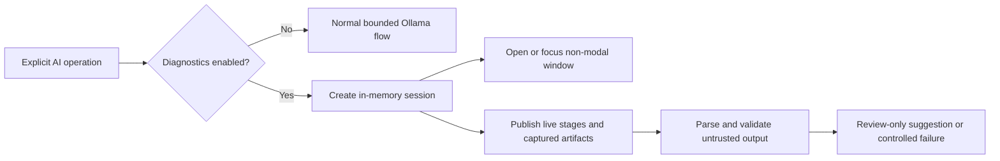
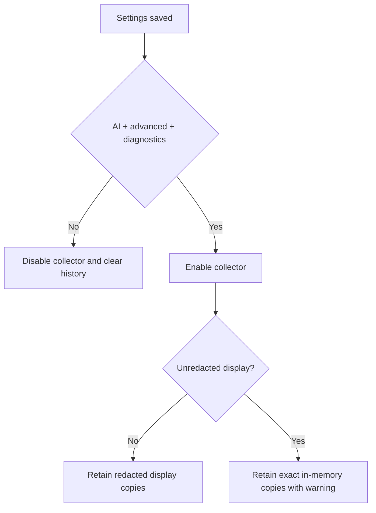

# OpenSorSe v1.0 Live AI Request Diagnostics

## Objective

Replace the existing completed-request summary with an opt-in, live, in-memory diagnostic trace for explicit Ollama operations. Diagnostics must never change request behavior, write prompt or response content to normal logs, or weaken suggestion validation.

## Current-state assessment

- `AiSettings.RequestDiagnosticsEnabled` backs **Enable AI request diagnostics**.
- `AiRequestDiagnosticsStore` retains at most 20 completed `AiRequestDiagnostic` records in a process-local queue.
- Rename, folder-plan, and document-text requests flow through `AiSuggestionService` to `OllamaSuggestionProvider.GenerateAsync`; connection checks use `/api/version` and discovery uses `/api/tags`.
- Generation currently posts to `/api/generate` with `model`, one `prompt`, `stream: false`, `format: "json"`, `keep_alive: "5m"`, and temperature `0.1`.
- The successful raw Ollama envelope is discarded; only its extracted `response` property is retained.
- `AiResponseParser.TryReadRequiredString` produces the generic invalid-`reason` warning when a model returns a non-string, empty, oversized, or control-containing value.
- Prompts describe a schema, but the transport sends only `format: "json"`. This mismatch permits structurally valid JSON that violates the response DTO.

## Scope

- Add an observable, UI-neutral diagnostics collector with a 20-session cap.
- Add an unredacted-display opt-in, off by default.
- Capture live stage transitions, exact outgoing prompts and serialized request JSON, raw response envelope, extracted assistant content, parsed JSON, and detailed validation.
- Open one reusable non-modal diagnostics window on a new diagnostic session.
- Use capability-specific JSON Schema in Ollama's `format` field, kept alongside the prompt/validator contract.
- Support copy, clear, JSON/text export, wrapping, auto-scroll, and multiple requests.

Out of scope: persistent diagnostics, authorization-header display, streaming generation, filesystem execution, and provider/plugin redesign.

## Flow

## Contracts and privacy

The collector lives in the Application layer and exposes immutable snapshots plus a change event. The Ollama transport publishes facts to it but has no Avalonia dependency. The Desktop observes events and dispatches updates to the UI thread.

Redaction is display-retention only; it does not alter the outgoing request. Default redaction replaces sensitive string values in captured JSON and prompt data. Records are cleared when diagnostics are disabled and when the process exits. Normal logging continues to record only safe summaries, counts, status codes, and exception categories.

Unknown response properties remain visible in parsed diagnostics but are ignored by application parsing for forward compatibility. Required fields, types, allowed statuses, bounds, source identities, filename/path safety, duplicates, and counts remain strict.

## Failure handling

Every operation terminates its session as succeeded, rejected, cancelled, timed out, or failed. Transport and diagnostics exceptions are isolated. Markdown fences remain rejected. Raw response data is captured before envelope parsing, including HTTP failures and malformed envelopes.

## Testing

Automated tests cover enablement, privacy modes, retention, clearing, event isolation, stage ordering, actual payload capture, raw/extracted/parsed separation, detailed `reason` validation, malformed JSON, HTTP/timeout/cancellation, and structured-output schema alignment.

## Manual verification

1. Enable AI, advanced features, AI request diagnostics, and unredacted content; save.
2. Start a rename request and confirm the diagnostics window opens immediately.
3. Observe live stages and inspect/copy system prompt, user prompt, request JSON, raw response, extracted content, parsed JSON, and validation.
4. Repeat with a folder plan and an unavailable/model-unavailable Ollama state.
5. Close the window during a request and confirm the request continues.
6. Disable diagnostics and save; confirm history is cleared and later requests do not open the window.
7. Confirm no suggestion changes a file or folder.

## Acceptance criteria

Diagnostics are opt-in, live, bounded, memory-only, privacy-aware, and failure-isolated; the transport sends a schema aligned with prompts and validators; the separate window supports inspection and export; disabled diagnostics retain nothing and create no session.
