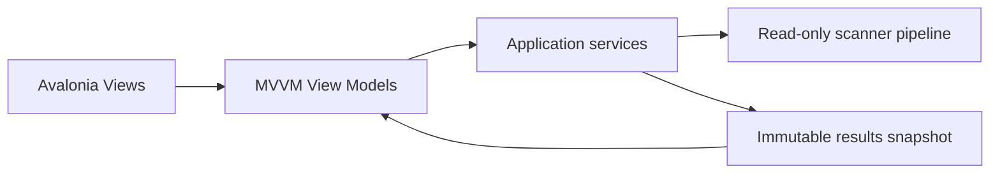

# GUI Overview

> The current GUI is an Avalonia MVVM desktop application focused on safe analysis, review, and separately confirmed restructuring.

---

## Current scope

The implemented Desktop application hosts these user-facing areas:

| Component | Current role |
| --- | --- |
| Main Window | Hosts the official OpenSorSe identity, six everyday destinations, a separately gated Advanced section, footer Help/About, and the persistent operation status bar. |
| Home | Shows one current-session latest-scan card and routes to primary workflows. |
| Scan | Accepts selected local folders and presents processing progress and cancellation. |
| Files | Hosts primary search, progressive filters, a resizable explorer table, selected-file details, warnings, bounded tags, and selection-only File Assistant controls. |
| Duplicates | Reuses the exact-duplicate review ViewModel as a primary friendly workflow without adding deletion. |
| Saved scans | Consolidates the scan library, saved metadata search, and advanced comparison behind local tabs. |
| Meaning Search Beta | Opens from Files, builds/searches a separately enabled bounded local index, and explains filename/tag/metadata/native/OCR/similarity matches. |
| Folder plans | Advanced preview/apply/history page with exact confirmation, repeat protection, filters, source/proposed/applied/current structures, and accessible diagrams. |
| Rules | Reviews and validates caller-supplied in-memory rule data. The current shell does not create, persist, or execute rules. |
| Settings | Edits implemented application settings. |
| Diagnostics | Presents aggregate logging health. |
| Operation History | Presents a review-only empty/in-memory foundation. The current workflow supplies no execution sessions and exposes no undo action. |
| Notifications | Shows non-blocking user-safe status messages. |

The current GUI exposes capped known-file/folder opening, local metadata/OCR controls, Semantic Search Beta, and one deterministic restructuring apply. It does not expose duplicate deletion, generic rule execution/undo, autonomous AI mutation, export, or live monitoring. AI remains review-only, and catalog/index/history maintenance changes only OpenSorSe application data.

## Presentation boundary

Views contain layout/bindings only. ViewModels coordinate application interfaces asynchronously; filesystem extraction, opening, semantic indexing, and restructuring remain behind injected application/service boundaries.

## Current usability guarantees

- Scan progress and cancellation are visible.
- Results are bounded through paging and are filtered and sorted in memory.
- Result and duplicate details reflect the completed scan; they do not inspect the live filesystem.
- The Results surface includes persistent read-only safety wording.
- Catalog, Catalog Search, and Compare Snapshots present historical metadata only; they do not refresh or access a selected file.
- Snapshot comparison holds at most 4,000 application changes and renders at most 500 rows for the active filters.
- User tags are application metadata only. Saved searches store names/query text only and always recalculate hits from the current catalog.
- Primary navigation is limited to Home, Scan, Files, Duplicates, Saved scans, and Settings. Specialist pages are in an Advanced group; Help and About are in the footer.
- Semantic theme resources define layered surfaces, text, borders, primary/organization/search/duplicate/AI accents, and success/warning/error colors for future light/dark refinement.
- Empty, limitation, and error states use user-safe messages.
- Fixed Results filters remain outside the independently scrolling result list; Duplicate details use a right drawer.
- The Files list owns remaining width until selection. Its details divider uses star sizing, 450/320 minimum pane widths, native pointer/keyboard resizing, and a validated 20–50% locally persisted ratio.
- File columns use shared size groups and keyboard-operable dividers so headers and realized rows remain aligned without adding a second table framework.
- Official branding is packaged as transparent Avalonia resources and is used by both the native window icon and sidebar at device-independent sizes.
- Settings owns the persistent AI and Advanced controls; the shell centrally hides stale gated destinations and safely returns to Home.
- Structure diagrams are capped at 500 visible nodes and provide text labels for every change state.

## Future design material

The remaining GUI documents may describe future pages or extension points such as reports, dialogs, themes, and plugin-provided UI. Those descriptions are design intent unless a current release document or implementation specification identifies a feature as implemented.

## Related documents

- [System Overview](../00_System/00_Overview.md)
- [Results Page](04_Results_Page.md)
- [Catalog and Catalog Search](11_Catalog_Page.md)
- [Catalog Comparison](12_Catalog_Comparison_Page.md)
- [Release Status](../../RELEASE_STATUS.md)
